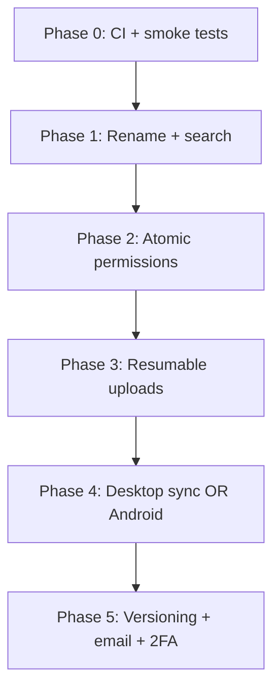

# Ownly Improvement Roadmap

**Date:** 2026-06-08  
**Status:** Living document — tracks product, platform, and operational improvements identified from codebase review.  
**Audience:** Maintainers, contributors, and agents planning feature work.

---

## Executive summary

Ownly is a self-hosted personal cloud (Rust/Axum API, Vite/React web UI, PostgreSQL, Nebular OS object storage, native iOS client). Core flows work end-to-end: setup wizard, auth, folder/file management, upload with HLS/video processing, public and user shares, recycle bin, admin console, multi-node storage registration, and audit logging. Security audit findings in [`security-audit.md`](../security-audit.md) are marked **fixed**.

The largest gaps versus commercial drives (OneDrive, Google Drive, MEGA) fall into four buckets:

1. **Authorization model** — owner-only + share links; coarse `users.role` instead of granular grants.
2. **Daily-use file ops** — no rename; basic filename search only.
3. **Reliability at scale** — single-shot browser uploads up to 10 GiB; no versioning.
4. **Client coverage** — web + iOS browse/upload; no desktop sync or Android app.

This document expands each improvement area with **current state**, **proposed direction**, **key files**, **dependencies**, **verification**, and **rough effort**. Use the [suggested priority order](#suggested-priority-order) at the end when sequencing work.

---

## Table of contents

1. [High impact — product gaps](#1-high-impact--product-gaps)
   - [1.1 Atomic permissions](#11-atomic-permissions-already-designed)
   - [1.2 Rename files and folders](#12-rename-files-and-folders)
   - [1.3 Better search](#13-better-search)
   - [1.4 Resumable large uploads](#14-resumable-large-uploads)
   - [1.5 File versioning](#15-file-versioning)
2. [Platform and clients](#2-platform-and-clients)
   - [2.1 Desktop sync client](#21-desktop-sync-client)
   - [2.2 Android client](#22-android-client)
   - [2.3 Expand iOS offline](#23-expand-ios-offline)
3. [In-app editors (active workstream)](#3-in-app-editors-active-workstream)
4. [Operations and production readiness](#4-operations-and-production-readiness)
   - [4.1 CI pipeline](#41-ci-pipeline)
   - [4.2 Frontend test coverage](#42-frontend-test-coverage)
   - [4.3 Ownly API observability](#43-ownly-api-observability)
   - [4.4 Email notifications](#44-email-notifications)
   - [4.5 Backup and restore tooling](#45-backup-and-restore-tooling)
5. [Security and identity (next tier)](#5-security-and-identity-next-tier)
6. [Storage and scale](#6-storage-and-scale)
7. [UX polish (lower cost, high delight)](#7-ux-polish-lower-cost-high-delight)
8. [Suggested priority order](#suggested-priority-order)
9. [Related documents](#related-documents)

---

## 1. High impact — product gaps

### 1.1 Atomic permissions (already designed)

**Priority:** P0 (architectural)  
**Effort:** Large (multi-sprint)  
**Spec:** [`docs/superpowers/specs/2026-05-25-atomic-permissions-design.md`](superpowers/specs/2026-05-25-atomic-permissions-design.md)

#### Problem

Today, file and folder access is effectively **owner-only**. Sharing works via:

- **Public links** (`public_shares`) — password, expiry, download limits.
- **User shares** (`resource_user_shares`) — grant another user access to a file or folder.

Administration uses a coarse **`users.role`** column (`admin`, `pro`, `standard`) checked in JWT claims:

```rust
// backend/src/admin/handlers.rs — require_admin checks claims.role only
pub fn require_admin(claims: &Claims) -> Result<(), AppError> {
    if claims.role == "admin" { Ok(()) } else { Err(AppError::Forbidden(...)) }
}
```

The admin UI **Roles** panel (`GET /api/v1/admin/users/roles`) returns a **hard-coded catalog** with permission strings like `instance.admin, users.manage` — these are labels, not enforced grants.

#### What implementing atomic permissions unlocks

| Capability | Today | With atomic grants |
|------------|-------|-------------------|
| Shared folder read/write/share | User-share only; no per-permission ACL | `content.read`, `content.write`, `content.share`, `content.delete` on folders |
| Delegated admin | All-or-nothing `role = admin` | `instance.audit.read`, `instance.users.manage`, etc. via group membership |
| Deny overrides | Not supported | Explicit deny beats allow on inherited folder grants |
| Collaboration foundation | Share links + user shares | Permission-aware API for future co-editing, comments, workflows |
| Audit clarity | Role changes in `users` table | One audit row per grant/revoke (`permissions.grant`, `permissions.revoke`) |

#### Recommended design (from spec)

- **Grant rows:** one row per `(subject, resource, permission, effect)` where subject is a user or group.
- **Inheritance:** folder grants flow to descendants; **deny wins** over allow.
- **Admin via groups:** seeded `admin` system group holds `instance.admin`; remove privileged `users.role` over time.
- **Permission catalog** in Rust — instance scope (`instance.settings.manage`, `instance.audit.read`, …) and content scope (`content.read`, `content.write`, …).

Proposed schema (from spec — next migration after current `021_*`):

- `groups`, `group_members`
- `permission_grants` (subject_type, subject_id, resource_type, resource_id, permission, effect)
- Resolver function used by every file/folder/share handler instead of `user_id = $1`

#### Key files to touch

| Layer | Paths |
|-------|-------|
| Migration | `backend/migrations/postgres/022_atomic_permissions.sql` (new) |
| Authz | New `backend/src/authz/` module (resolver, catalog, tests) |
| Handlers | `backend/src/files/handlers.rs`, `folders.rs`, `shares/handlers.rs` |
| Admin | `backend/src/admin/handlers.rs`, `console.rs` — replace `require_admin` with grant checks |
| Frontend | Admin users/security panels, share dialogs, drive listing (shared-with-me already exists) |
| Audit | `backend/src/audit.rs` — new actions for grant/revoke |

#### Dependencies and risks

- **Breaking change risk:** JWT `role` claims used across frontend (`useAuth`, admin route guard). Plan a migration: dual-read role + grants, then deprecate role in JWT.
- **Performance:** Resolver must be indexed and cache-friendly; folder ancestry walks need a materialized path or recursive CTE with limits.
- **Shares overlap:** Existing `resource_user_shares` may map to auto-grants or be replaced — decide in spec approval.

#### Verification

- Integration tests: user A grants `content.read` on folder to user B; B can list/download but not upload/delete.
- Deny test: allow on folder, deny on file; deny wins.
- Admin delegation: user in `auditors` group with `instance.audit.read` only cannot PATCH settings.
- `cargo test`, `cargo clippy`, manual smoke: share folder, login as grantee, upload denied.

---

### 1.2 Rename files and folders

**Priority:** P1 (daily use)  
**Effort:** Small–medium

#### Problem

**Move** exists; **rename** does not.

| Operation | API | Client |
|-----------|-----|--------|
| Move file | `PATCH /api/v1/files/{id}` → `move_file` in `backend/src/files/handlers.rs` | `moveFile()` in `frontend/src/api/client.ts` |
| Rename file | **Missing** | **Missing** |
| Rename folder | **Missing** | **Missing** |

Users expect inline rename (F2, slow double-click, context menu) in every drive product.

#### Proposed direction

**Backend**

- `PATCH /api/v1/files/{id}` — add optional `name` field (alongside existing `folder_id` for move), or dedicated `PATCH .../rename` if you prefer separation.
- `PATCH /api/v1/folders/{id}` — add `name` with validation (non-empty, no path separators, natural-sort collision handling in same parent).
- Audit: `files.rename`, `folders.rename`.
- Reject rename while file is processing (same guard as `move_file` uses via `ensure_file_not_processing`).

**Frontend**

- Explorer grid/list: inline edit or rename dialog.
- Context menu + keyboard shortcut (F2).
- iOS: long-press action parity with web.

**Edge cases**

- Duplicate names in same folder → `409 Conflict` (match upload preflight behavior).
- Rename shared resource → notify grantees? (future; out of scope for v1 rename).

#### Key files

- `backend/src/files/handlers.rs`, `backend/src/files/folders.rs`
- `frontend/src/api/client.ts`, `DrivePage.tsx`, explorer components
- `backend/tests/http_integration.rs` — add rename happy path + conflict test
- `ios/Ownly/Features/Files/` — mirror API

#### Verification

- Rename file in folder; list reflects new name; download `Content-Disposition` uses new name.
- Rename folder; children paths unchanged (folder_id stable).
- `cargo test`; `npm run build`; manual smoke on drive.

---

### 1.3 Better search

**Priority:** P1  
**Effort:** Medium (Postgres FTS) to Large (Meilisearch + content indexing)

#### Current state

Search is **filename substring match on files only**:

```sql
-- backend/src/files/listing.rs — LOWER(f.name) LIKE $pattern
"LOWER(f.name) LIKE $2"
```

- Query param: `GET /api/v1/files?q=...` via `listFiles()` in `frontend/src/api/client.ts`.
- **Folders are not searched** — `list_folders` has no `q` parameter.
- Index: `backend/migrations/postgres/007_files_search_index.sql` — `idx_files_user_name_lower ON files (user_id, (LOWER(name)))` helps `LIKE` but not ranking or fuzzy match.
- Drive UI: search mode clears folders and shows file hits only (`DrivePage.tsx`).

#### Gaps

| Gap | Impact |
|-----|--------|
| No folder search | Users cannot find folders by name without browsing |
| No ranking | `report.pdf` and `my-report-final-v2.pdf` ordered by natural sort, not relevance |
| No fuzzy match | Typos miss results |
| No content search | PDF/doc text not indexed |
| No shared-library search | Search scoped to owned files (`user_id = $1`) |

#### Option A — Postgres full-text (recommended first step)

- Add `search_vector tsvector` column on `files` and `folders` (name + optional metadata).
- GIN index per user or composite `(user_id, search_vector)`.
- Replace `LIKE` with `search_vector @@ plainto_tsquery(...)` + `ts_rank` ordering.
- Unified endpoint: `GET /api/v1/search?q=&types=file,folder&limit=&offset=`.

**Pros:** No new service; fits self-hosted story.  
**Cons:** Content indexing still separate; English-centric unless configured.

#### Option B — Meilisearch sidecar

- Index file/folder documents on create/update/delete (async job).
- Optional OCR/text extraction pipeline for PDFs.

**Pros:** Fast fuzzy search, facets (type, date, folder).  
**Cons:** Extra container, sync complexity, ops burden.

#### Option C — Content indexing (either backend)

- Extract text on upload (PDF via existing preview stack, plain text, Office via future pipeline).
- Store in `file_search_content` table or Meilisearch field.
- Background job; respect quota and privacy (owner-only until permissions ship).

#### Key files

- New migration for FTS columns/indexes
- `backend/src/files/listing.rs` or new `backend/src/search/`
- `frontend/src/pages/DrivePage.tsx` — unified search results UI
- Job worker if async indexing: `backend/src/jobs/`

#### Verification

- Search returns folders and files ranked by relevance.
- Large library perf test (10k+ files) — query under acceptable latency.
- Regression: empty `q` still lists folder contents normally.

---

### 1.4 Resumable large uploads

**Priority:** P1–P2  
**Effort:** Large  
**Follow-ups:** [`docs/resumable-upload-improvements.md`](resumable-upload-improvements.md) — MVP shipped 2026-06-16; janitor, iOS, disk, and direct-to-storage next steps.

#### Shipped MVP (2026-06-16)

| Layer | Behavior |
|-------|----------|
| **Web client (> 32 MiB)** | Chunked session API — `POST /uploads`, `PUT` parts, `POST /complete`; retry skips received parts |
| **Web client (≤ 32 MiB)** | Single `POST /api/v1/files/upload` (unchanged) |
| **API** | `backend/src/uploads/` + migration `029_upload_sessions.sql`; shared `upload_finalize` |
| **iOS** | Still single multipart POST — see follow-up doc |
| **Limit** | `MAX_UPLOAD_BYTES` default **10 GiB** |

#### Original gap (pre-MVP)

| Layer | Behavior |
|-------|----------|
| **Web client** | Single `multipart/form-data` POST to `POST /api/v1/files/upload` |
| **API** | `upload_file` read entire body in one pass |
| **Nebular OS** | Multipart upload API in submodule — not yet wired through Ownly UX |

Failed uploads mid-stream required **restarting from byte zero** on web. MVP addresses large web uploads; **iOS**, **temp janitor**, and **API-disk** optimizations are tracked in [`resumable-upload-improvements.md`](resumable-upload-improvements.md).

#### Remaining direction (post-MVP)

See [`resumable-upload-improvements.md`](resumable-upload-improvements.md) for prioritized follow-ups: janitor protection, session expiry sweeper, iOS parity, video-only threshold, append-on-write, parallel parts, direct-to-Nebular streaming.

**Nebular boundary:** Per [`nebular-os-vendor.mdc`](../.cursor/rules/nebular-os-vendor.mdc), multipart behavior changes in Nebular belong upstream; Ownly integration stays here.

---

### 1.5 File versioning

**Priority:** P2  
**Effort:** Medium–large

#### Current state

Migration `021_file_content_hash.sql` adds:

```sql
ALTER TABLE files ADD COLUMN content_hash TEXT;
CREATE INDEX idx_files_user_content_hash ON files (user_id, content_hash) WHERE deleted_at IS NULL;
```

Used for **duplicate detection** on upload preflight (`check_upload_names`), not history.

There is **no** `file_versions` table, no "restore previous version" UI, no automatic versioning on overwrite.

#### Proposed direction

**Schema (illustrative)**

```sql
CREATE TABLE file_versions (
    id            TEXT PRIMARY KEY,
    file_id       TEXT NOT NULL REFERENCES files(id),
    version_number INT NOT NULL,
    storage_key     TEXT NOT NULL,
    size_bytes      BIGINT NOT NULL,
    content_hash    TEXT,
    created_by      TEXT REFERENCES users(id),
    created_at      TIMESTAMPTZ NOT NULL DEFAULT now(),
    UNIQUE (file_id, version_number)
);
```

**Behavior**

- On upload replacing same path/name: optionally bump version (configurable: always / manual / off).
- Retention policy: keep last N versions or N days (admin setting).
- Download specific version; restore promotes copy to current.
- Blob lifecycle: old versions reference same Nebular keys until purge job runs.

**Relation to dedup:** Version rows may share `content_hash` / storage key when content unchanged.

#### Key files

- New migration, `backend/src/files/versions.rs`
- Upload handler — branch on existing file name in folder
- Frontend: file details panel version list
- Delete job — purge orphaned version blobs

#### Verification

- Upload `doc.pdf` twice; two versions listed; restore v1 works.
- Permanent delete file removes all version blobs.
- Quota counts current + versions policy (define explicitly).

---

## 2. Platform and clients

### 2.1 Desktop sync client

**Priority:** P2 (high user value, large effort)  
**Effort:** Very large

#### Problem

Web and iOS support **manual** browse/upload/download. There is no:

- Filesystem watch (sync folder ↔ Ownly)
- Delta sync (upload only changed blocks)
- Conflict resolution (two devices edit same file)
- Offline edit queue with sync on reconnect

This is the primary reason users stay on OneDrive/Google Drive for daily work.

#### Proposed direction

**Phase 1 — Read-only mount or selective sync**

- Electron/Tauri tray app or FUSE adapter (platform-specific).
- Authenticate with existing JWT; persist refresh strategy.
- Sync down selected folders; upload new/changed files.

**Phase 2 — Full bidirectional sync**

- Server: sync cursor / change feed API (`GET /api/v1/sync/changes?since=`) listing creates/updates/deletes per user.
- Client: local state DB (SQLite), conflict UI.

**Reuse**

- Resumable uploads ([§1.4](#14-resumable-large-uploads)) mandatory for desktop.
- `content_hash` for skip-if-unchanged.

#### Key dependencies

- Atomic permissions ([§1.1](#11-atomic-permissions-already-designed)) for shared-folder sync.
- Stable API versioning and OpenAPI doc.

#### Verification

- Edit file locally; appears on web within sync interval.
- Conflict: two offline edits → user prompted; no silent data loss.

---

### 2.2 Android client

**Priority:** P2  
**Effort:** Large

#### Current state — iOS reference

[`ios/README.md`](../ios/README.md) documents:

- Auth with Keychain, server config sheet, health pill
- `FilesView` — list, pull-to-refresh, long-press actions (details, download, favourites, public link, delete)
- Upload queue with phased progress (upload → encode → storage for video)
- Offline: **top-level listing cache only**; session revalidation on reconnect

No `android/` directory in the repo.

#### Proposed direction

- Kotlin + Compose (or Flutter/React Native if cross-platform preferred — iOS is native Swift today).
- Mirror `/api/v1` paths and `{ error: { code, message } }` envelope per `frontend/src/api/client.ts`.
- Feature parity milestones: auth → list/browse → upload queue → shares → offline cache.

#### Verification

- Physical device on LAN against Docker stack.
- Upload video; HLS progress matches web transfer panel semantics.

---

### 2.3 Expand iOS offline

**Priority:** P2  
**Effort:** Medium

#### Current state

From `ios/README.md`:

> Offline: top-level listing cache (names and types only). No nested folders. Connection error screen with "Check again."

#### Proposed improvements

| Feature | Benefit |
|---------|---------|
| Nested folder cache | Browse library offline on flights |
| Background refresh | `BGAppRefreshTask` when on Wi-Fi |
| Share extension | Upload from Photos/Files app |
| Download for offline | Pin files locally (encrypted container) |
| Push notifications | Share invites, upload complete (requires APNs + backend) |

#### Key files

- `ios/Ownly/Features/Files/DriveViewModel.swift`
- New Core Data or SQLite cache layer with folder tree
- Share extension target in Xcode project

#### Verification

- Airplane mode: navigate into cached subfolder; open cached file.
- Share sheet upload completes when network returns.

---

## 3. In-app editors (active workstream)

**Trackers:**

- [`docs/excel-editor-feature-parity.md`](excel-editor-feature-parity.md)
- [`docs/superpowers/plans/2026-06-08-excel-365-full-parity.md`](superpowers/plans/2026-06-08-excel-365-full-parity.md)

The in-browser Excel editor is substantial (ribbon, formulas, pivot summaries, print preview, Copilot sidebar). Mobile is **read-only** (`useIsDesktopExcelViewport` gates edit mode).

### Remaining high-value gaps

| Area | Status | Gap | Planned work |
|------|--------|-----|--------------|
| **Formulas** | 🚧 Partial | Dynamic arrays (FILTER, SORT, UNIQUE), LAMBDA, fuller function library | Wave 2 in parity plan — `formula-dynamic-arrays.ts`, `formula-extended.ts` |
| **Save fidelity** | 🚧 Partial | Full OOXML style/chart round-trip | Wave 1–3 — `xlsx-charts-ooxml.ts`, `cell-styles.ts` numFmt |
| **Structured refs** | ⏳ | `Table[Column]` syntax | `formula-sheet-refs.ts` extensions |
| **Copilot** | 🚧 | Local heuristics only | Wave 5 — `POST /api/v1/spreadsheet/copilot` + audit |
| **Collaboration** | ❌ | Real-time co-editing | Requires backend sync session token; explicitly deferred |
| **Track changes** | ❌ | | Wave 3 workbook ops |
| **Mobile edit** | ❌ | Read-only preview on small viewports | Wave 4 — optional read-only polish only |

### Implementation file map (from tracker)

| Area | Path |
|------|------|
| Ribbon | `frontend/src/components/drive/excel/ExcelSpreadsheetRibbon.tsx` |
| Workbook ops | `frontend/src/lib/spreadsheet/workbook-ops.ts` |
| OOXML metadata | `frontend/src/lib/spreadsheet/xlsx-metadata-ooxml.ts` |
| Copilot UI | `frontend/src/components/drive/excel/ExcelCopilotSidebar.tsx` |

### Verification (editor changes)

- `npm run build` + `npm run lint`
- Round-trip: edit in Ownly → download → open in Excel Desktop → save → re-upload → cells/styles preserved
- `cargo test` if Copilot backend added

---

## 4. Operations and production readiness

### 4.1 CI pipeline

**Priority:** P0 (engineering)  
**Effort:** Small

#### Current state

- **No** `.github/workflows/` in the repository.
- Verification is documented manually in README and [`.cursor/rules/regression-testing.mdc`](../.cursor/rules/regression-testing.mdc):

| Area | Command |
|------|---------|
| Backend | `cargo test -p ownly-backend`, `cargo clippy -p ownly-backend -- -D warnings` |
| Frontend | `npm run build`, `npm run lint` |
| Security audit unit tests | `python -m unittest discover -s scripts/security-audit/tests -v` |

#### Proposed minimal GitHub Actions workflow

**Triggers:** `pull_request`, `push` to `dev` / `master`

**Jobs:**

1. **backend** — Postgres service container; `DATABASE_URL` set; `cargo test`; `cargo clippy -D warnings`
2. **frontend** — `npm ci`; `npm run build`; `npm run lint`
3. **security-audit-tests** — stdlib Python only; unittest discover
4. **frontend-docker** (optional, on frontend lockfile changes) — `docker build -f frontend/Dockerfile frontend` per [`.cursor/rules/frontend-npm-lockfile-docker.mdc`](../.cursor/rules/frontend-npm-lockfile-docker.mdc)

**Optional nightly:** spin Compose stack; run `scripts/security-audit/sec001_*.py` … against `http://127.0.0.1:8080`

#### Verification

- PR cannot merge with failing jobs.
- Document required secrets (none for unit jobs).

---

### 4.2 Frontend test coverage

**Priority:** P1  
**Effort:** Medium

#### Current state

| Layer | Coverage |
|-------|----------|
| Backend unit tests | Extensive — `#[cfg(test)]` in most modules (HLS, storage, quota, delete jobs, …) |
| Backend HTTP integration | Single file `backend/tests/http_integration.rs` (~25 test functions); **requires `DATABASE_URL`** or skips |
| Frontend | **No** Vitest, Playwright, or Testing Library in `frontend/package.json` |
| Security audit | Good unit test coverage under `scripts/security-audit/tests/` |

#### Proposed direction

**Unit/component (Vitest + React Testing Library)**

- `getErrorMessage` / API client error parsing
- Explorer helpers (`explorer-file-list-updates.ts`, natural sort)
- Spreadsheet formula modules (pure functions)

**E2E smoke (Playwright)**

- Setup wizard → login → upload small file → download → delete
- Public share link open (no auth)
- Admin login → users list (if test fixture supports)

Run E2E against Compose in CI or mock API for PR speed.

#### Verification

- `npm test` in frontend package.json
- CI job green; failures block merge.

---

### 4.3 Ownly API observability

**Priority:** P2  
**Effort:** Medium

#### Current state

| Component | Observability |
|-----------|---------------|
| **Nebular OS** | `GET /metrics` JSON — used by `backend/src/admin/storage_nodes.rs` for capacity |
| **Ownly API** | `tracing` + `TraceLayer`; request ID middleware; admin overview KPIs |
| **Admin UI** | Workload bars from `audit_logs` counts; storage node health probe |

No Prometheus scrape endpoint on Ownly itself.

#### Proposed metrics (Prometheus text or `/metrics` JSON mirror Nebular)

- `http_requests_total{method,route,status}`
- `http_request_duration_seconds` histogram
- `upload_bytes_total`, `upload_failures_total`
- `background_jobs_active`, `background_jobs_failed_total`
- `storage_put_gate_wait_seconds` (if gated)
- `storage_node_health` gauge per registered node

Expose on `GET /api/v1/metrics` (admin-only or internal network) or separate bind port.

#### Verification

- Grafana dashboard example in `docs/`
- Alert rules: API down, job queue stalled, storage node unhealthy

---

### 4.4 Email notifications

**Priority:** P2  
**Effort:** Medium

#### Current state

Admin settings **persist** SMTP configuration in `app_settings`:

- Keys: `smtp_host`, `smtp_port`, `smtp_from`, `smtp_security`, `smtp_username`, `smtp_password`
- Notification rule toggles: `notification_storage_offline`, `notification_audit_violations`, `notification_quota_alerts`

Implemented in `backend/src/admin/console.rs` (`get_settings` / `patch_settings`).

**There is no mail-sending code** — no `lettre` dependency, no notification worker.

#### Proposed direction

1. Add `backend/src/notifications/` — SMTP sender from settings, templated HTML/text.
2. Triggers:
   - Quota threshold (80%, 100%) — on upload or daily scan
   - Storage node offline — admin overview probe failure
   - Share invite (when user-share creates account invite)
   - Password reset (future)
3. Audit: `notifications.send` (no secrets in context).
4. Admin test email button in System Settings panel.

#### Verification

- Mailhog in Compose profile for dev
- Toggle rule; trigger condition; email received
- Missing SMTP → graceful skip + log, no panic

---

### 4.5 Backup and restore tooling

**Priority:** P1 for production adopters  
**Effort:** Medium

#### Current state

- README recommends **managed PostgreSQL** with backups for production — not Docker volumes.
- Nebular blobs live on disk/volume under Nebular data dir.
- `app_settings` and user metadata in Postgres.
- `scripts/storage-audit.py` compares logical vs on-disk bytes — diagnostic, not backup.

**No** documented runbook or scripted export/import.

#### Proposed deliverables

| Artifact | Contents |
|----------|----------|
| `docs/backup-restore.md` | Runbook: pg_dump, blob volume snapshot, settings export, order of restore |
| `scripts/backup-ownly.sh` | pg_dump + optional tar of Nebular data path + manifest JSON |
| `scripts/restore-ownly.sh` | Validate manifest, restore DB, restore blobs, run migrations |
| Compose profile | Optional `backup` sidecar (restic/borg) — only if user explicitly wants it |

#### Verification

- Backup dev stack → wipe volumes (explicit test env) → restore → login, files downloadable
- Document RPO/RTO expectations honestly for self-hosters

---

## 5. Security and identity (next tier)

**Baseline:** [`security-audit.md`](../security-audit.md) — 5 High + 7 Medium findings, all marked **Fixed**. Probes under `scripts/security-audit/`.

### Recommended next steps

| Item | Rationale | Notes |
|------|-----------|-------|
| **2FA / WebAuthn** | Protect admin accounts and high-value libraries | Store credentials per user; backup codes; audit `auth.webauthn.register` |
| **OAuth/OIDC** | Teams avoiding local passwords | Google, GitHub, Authentik; map to local user or JIT provision; link existing email |
| **SEC-00x in CI** | Regression on security fixes | Nightly Compose + `sec001`…`sec012` scripts; SARIF upload optional |
| **Session/device UX** | Users cannot see active sessions today | API exists: `GET /api/v1/admin/users/{id}/sessions`, revoke endpoints in `lib.rs`; add **Profile → Security** for self-service (non-admin: `GET /api/v1/me/sessions`) |
| **Passkeys for share links** | Optional | Lower priority than account 2FA |

### Session infrastructure (already present)

`backend/src/user_sessions.rs`:

- Session epoch bump on password change / revoke-all
- Per-session revoke
- JWT validated against revocation list in `auth_middleware`

Frontend surfacing is the main gap.

### Verification

- WebAuthn register/login e2e test (playwright or manual)
- OIDC login creates session; audit `auth.login` with provider claim
- SEC scripts exit 0 on CI stack after setup complete

---

## 6. Storage and scale

### Current capabilities

- **Multi-node registration** — `storage_nodes` table, admin UI, placement in `backend/src/storage/placement.rs`
- **Second node Compose** — `docker-compose.rep.yml` profile (node B on port 9001)
- **Nebular cluster modes** — scrub sampling, wire checksums, dead-letter replay, and webhooks shipped upstream (`1e94546` on `master`; see `nebular-os/docs/plans/cluster-modes.md`)
- **Recycle bin** — 30-day retention (`RECYCLE_BIN_RETENTION_DAYS`); **background purger exists** — `start_recycle_bin_purger()` in `lib.rs`, runs every 6 hours via `purge_expired_recycle_bin`
- **Content hash** — per-user duplicate preflight, not cross-user dedup
- **Storage audit** — `scripts/storage-audit.py` walks Nebular blob tree vs Postgres sums

### Improvements

| Item | Detail |
|------|--------|
| **Recycle bin monitoring** | Purger exists; add metric/log alert if purge fails repeatedly; admin UI "last purge" timestamp |
| **Cross-node replication** | Ownly placement + Nebular replicated mode; failover read path; document in ops guide |
| **Storage audit automation** | Cron/K8s job runs `storage-audit.py`; alert on drift > threshold |
| **Blob-level dedup** | Optional global dedup by `content_hash` — saves disk, complex quota accounting and legal/implications; policy decision |
| **GPU HLS** | Already supported via `docker-compose.gpu.yml`; document capacity planning |

### Verification

- Two-node profile: upload lands on node A; replication visible on B (after Nebular bump)
- Storage audit CI job fails on injected drift (test fixture)

---

## 7. UX polish (lower cost, high delight)

Quick wins that compound:

| Item | Detail |
|------|--------|
| **Rename** | See [§1.2](#12-rename-files-and-folders) |
| **Bulk rename** | Pattern rename (`vacation-{n}.jpg`) — after single rename ships |
| **Keyboard shortcuts** | Drive: Ctrl+A select all, Delete → recycle bin, arrow navigation, F2 rename |
| **Search folders** | See [§1.3](#13-better-search) |
| **Mobile web parity** | Transfer panel visibility, offline banner, touch targets — compare to iOS |
| **Landing/marketing pages** | `LandingPage`, `PricingPage`, `FeaturesPage` — decide: keep for public demo instances vs redirect authenticated users to `/` only |
| **Empty states** | Onboarding hints for first upload, share, admin |
| **Bulk operations** | Multi-select move/delete/share — partial today; polish consistency |

---

## Suggested priority order

Pragmatic sequencing balancing **risk reduction**, **daily-use value**, and **architecture**:



### Phase summary

| Phase | Focus | Why first |
|-------|-------|-----------|
| **0** | CI + frontend smoke tests | Cheap; protects all subsequent work |
| **1** | Rename + improved search | Daily-use wins; small API surface |
| **2** | Atomic permissions | Unlocks real sharing and collaboration |
| **3** | Resumable uploads | Matches 10 GiB cap; prerequisite for desktop sync |
| **4** | Desktop sync **or** Android | Expands beyond "web locker" |
| **5** | Versioning, email notifications, 2FA | Production-grade polish |

### Effort rough guide

| Size | Calendar (solo maintainer, indicative) |
|------|--------------------------------------|
| Small | 1–3 days |
| Medium | 1–2 weeks |
| Large | 2–6 weeks |
| Very large | 2+ months |

---

## Related documents

| Topic | Location |
|-------|----------|
| Atomic permissions design | [`docs/superpowers/specs/2026-05-25-atomic-permissions-design.md`](superpowers/specs/2026-05-25-atomic-permissions-design.md) |
| Excel editor parity | [`docs/excel-editor-feature-parity.md`](excel-editor-feature-parity.md) |
| Excel full parity plan | [`docs/superpowers/plans/2026-06-08-excel-365-full-parity.md`](superpowers/plans/2026-06-08-excel-365-full-parity.md) |
| Security audit | [`security-audit.md`](../security-audit.md) |
| Security audit scripts | [`scripts/security-audit/README.md`](../scripts/security-audit/README.md) |
| Storage disk tuning | [`docs/storage-disk-tuning.md`](storage-disk-tuning.md) |
| Resumable upload follow-ups | [`docs/resumable-upload-improvements.md`](resumable-upload-improvements.md) |
| Regression testing rule | [`.cursor/rules/regression-testing.mdc`](../.cursor/rules/regression-testing.mdc) |
| iOS client | [`ios/README.md`](../ios/README.md) |
| Nebular cluster plan (upstream) | `nebular-os/docs/plans/cluster-modes.md` (submodule) |
| Project README | [`README.md`](../README.md) |

---

## Document maintenance

- Update **Last updated** when adding or completing roadmap items.
- When an item ships, add a line under it: **Status: Done (YYYY-MM-DD, PR/commit)**.
- Link new migrations, API routes, and docs from the relevant section.
- Prefer marking recycle-bin purger and other "already done" infrastructure accurately — avoid re-implementing existing background jobs.
