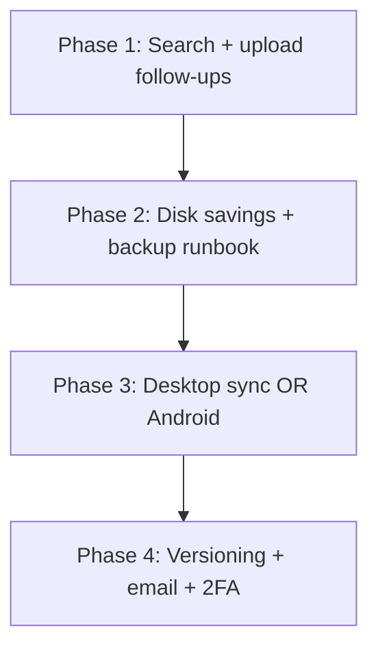

# Ownly Improvement Roadmap

**Date:** 2026-06-18 (pruned — completed items removed)  
**Status:** Living document — tracks **remaining** product, platform, and operational improvements.  
**Audience:** Maintainers, contributors, and agents planning feature work.

---

## Executive summary

Ownly is a self-hosted personal cloud (Rust/Axum API, Vite/React web UI, PostgreSQL, Nebular OS object storage, native iOS client). Core flows work end-to-end: setup wizard, auth, folder/file management, upload with HLS/video processing, public and user shares, recycle bin, admin console, multi-node storage registration, audit logging, **atomic permissions**, **file/folder rename**, **resumable web uploads (> 32 MiB)**, and **GitHub Actions CI** (backend tests, clippy, frontend build/lint/unit tests, Playwright smoke). Security audit findings in [`security-audit.md`](../security-audit.md) are marked **fixed**.

The largest **remaining** gaps versus commercial drives fall into four buckets:

1. **Daily-use file ops** — basic filename search only; no unified folder search or relevance ranking.
2. **Reliability at scale** — resumable upload hardening (direct-to-Nebular, iOS background resume); no file versioning.
3. **Client coverage** — web + iOS browse/upload; no desktop sync or Android app.
4. **Production polish** — email notifications, backup runbooks, API metrics, expanded E2E coverage.

This document lists only **not-yet-implemented** work. Shipped features (atomic permissions migration `022_*`, rename API, resumable upload MVP migration `029_*`, CI workflow, Vitest/Playwright) are omitted here.

---

## Table of contents

1. [High impact — product gaps](#1-high-impact--product-gaps)
   - [1.1 Better search](#11-better-search)
   - [1.2 Resumable upload follow-ups](#12-resumable-upload-follow-ups)
   - [1.3 File versioning](#13-file-versioning)
2. [Platform and clients](#2-platform-and-clients)
   - [2.1 Desktop sync client](#21-desktop-sync-client)
   - [2.2 Android client](#22-android-client)
   - [2.3 Expand iOS offline](#23-expand-ios-offline)
3. [In-app editors (remaining work)](#3-in-app-editors-remaining-work)
4. [Operations and production readiness](#4-operations-and-production-readiness)
   - [4.1 Expand frontend E2E coverage](#41-expand-frontend-e2e-coverage)
   - [4.2 Ownly API observability](#42-ownly-api-observability)
   - [4.3 Email notifications](#43-email-notifications)
   - [4.4 Backup and restore tooling](#44-backup-and-restore-tooling)
5. [Security and identity (next tier)](#5-security-and-identity-next-tier)
6. [Storage and scale](#6-storage-and-scale)
7. [UX polish](#7-ux-polish)
8. [Suggested priority order](#suggested-priority-order)
9. [Related documents](#related-documents)

---

## 1. High impact — product gaps

### 1.1 Better search

**Priority:** P1  
**Effort:** Medium (Postgres FTS) to Large (Meilisearch + content indexing)

#### Current state

Search is **filename substring match on files only**:

```sql
-- backend/src/files/listing.rs — LOWER(f.name) LIKE $pattern
"LOWER(f.name) LIKE $2"
```

- Query param: `GET /api/v1/files?q=...` via `listFiles()` in `frontend/src/api/client.ts`.
- **Folders are not searched** — `list_folders` has no `q` parameter.
- Index: `backend/migrations/postgres/007_files_search_index.sql` — `idx_files_user_name_lower ON files (user_id, (LOWER(name)))` helps `LIKE` but not ranking or fuzzy match.
- Drive UI: search mode clears folders and shows file hits only (`DrivePage.tsx`).

#### Gaps

| Gap | Impact |
|-----|--------|
| No folder search | Users cannot find folders by name without browsing |
| No ranking | `report.pdf` and `my-report-final-v2.pdf` ordered by natural sort, not relevance |
| No fuzzy match | Typos miss results |
| No content search | PDF/doc text not indexed |
| No shared-library search | Search scoped to owned files (`user_id = $1`) — atomic permissions exist but search does not traverse grants |

#### Option A — Postgres full-text (recommended first step)

- Add `search_vector tsvector` column on `files` and `folders` (name + optional metadata).
- GIN index per user or composite `(user_id, search_vector)`.
- Replace `LIKE` with `search_vector @@ plainto_tsquery(...)` + `ts_rank` ordering.
- Unified endpoint: `GET /api/v1/search?q=&types=file,folder&limit=&offset=`.

**Pros:** No new service; fits self-hosted story.  
**Cons:** Content indexing still separate; English-centric unless configured.

#### Option B — Meilisearch sidecar

- Index file/folder documents on create/update/delete (async job).
- Optional OCR/text extraction pipeline for PDFs.

**Pros:** Fast fuzzy search, facets (type, date, folder).  
**Cons:** Extra container, sync complexity, ops burden.

#### Option C — Content indexing (either backend)

- Extract text on upload (PDF via existing preview stack, plain text, Office via future pipeline).
- Store in `file_search_content` table or Meilisearch field.
- Background job; respect quota and privacy (grant-aware when permissions apply).

#### Key files

- New migration for FTS columns/indexes
- `backend/src/files/listing.rs` or new `backend/src/search/`
- `frontend/src/pages/DrivePage.tsx` — unified search results UI
- Job worker if async indexing: `backend/src/jobs/`

#### Verification

- Search returns folders and files ranked by relevance.
- Large library perf test (10k+ files) — query under acceptable latency.
- Regression: empty `q` still lists folder contents normally.

---

### 1.2 Resumable upload follow-ups

**Priority:** P2  
**Effort:** Medium–large  
**Tracker:** [`docs/resumable-upload-improvements.md`](resumable-upload-improvements.md)

Chunked uploads (migration `029_upload_sessions.sql`), janitor protection, session expiry sweeper (without expiry audit), append-on-write, web video threshold (8 MiB), parallel parts, reload resume UX, and iOS chunked upload (without background/app-kill resume) are **shipped**. Remaining work:

| Item | Summary |
|------|---------|
| **Direct-to-Nebular** | Stream parts to object storage when API disk is the bottleneck |
| **iOS background resume** | Background `URLSession` + persist server `session_id` across app kill |
| **Expiry audit** (optional) | `uploads.session.expire` in `audit_logs` when janitor aborts stale sessions |

**Nebular boundary:** Per [`nebular-os-vendor.mdc`](../.cursor/rules/nebular-os-vendor.mdc), multipart behavior changes in Nebular belong upstream; Ownly integration stays here.

---

### 1.3 File versioning

**Priority:** P2  
**Effort:** Medium–large

#### Current state

Migration `021_file_content_hash.sql` adds `content_hash` for **duplicate detection** on upload preflight (`check_upload_names`), not history.

There is **no** `file_versions` table, no "restore previous version" UI, no automatic versioning on overwrite.

#### Proposed direction

**Schema (illustrative)**

```sql
CREATE TABLE file_versions (
    id            TEXT PRIMARY KEY,
    file_id       TEXT NOT NULL REFERENCES files(id),
    version_number INT NOT NULL,
    storage_key     TEXT NOT NULL,
    size_bytes      BIGINT NOT NULL,
    content_hash    TEXT,
    created_by      TEXT REFERENCES users(id),
    created_at      TIMESTAMPTZ NOT NULL DEFAULT now(),
    UNIQUE (file_id, version_number)
);
```

**Behavior**

- On upload replacing same path/name: optionally bump version (configurable: always / manual / off).
- Retention policy: keep last N versions or N days (admin setting).
- Download specific version; restore promotes copy to current.
- Blob lifecycle: old versions reference same Nebular keys until purge job runs.

**Relation to dedup:** Version rows may share `content_hash` / storage key when content unchanged (see [`storage-disk-improvements.md`](storage-disk-improvements.md) §2).

#### Key files

- New migration, `backend/src/files/versions.rs`
- Upload handler — branch on existing file name in folder
- Frontend: file details panel version list
- Delete job — purge orphaned version blobs

#### Verification

- Upload `doc.pdf` twice; two versions listed; restore v1 works.
- Permanent delete file removes all version blobs.
- Quota counts current + versions policy (define explicitly).

---

## 2. Platform and clients

### 2.1 Desktop sync client

**Priority:** P2 (high user value, large effort)  
**Effort:** Very large

#### Problem

Web and iOS support **manual** browse/upload/download. There is no:

- Filesystem watch (sync folder ↔ Ownly)
- Delta sync (upload only changed blocks)
- Conflict resolution (two devices edit same file)
- Offline edit queue with sync on reconnect

#### Proposed direction

**Phase 1 — Read-only mount or selective sync**

- Electron/Tauri tray app or FUSE adapter (platform-specific).
- Authenticate with existing JWT; persist refresh strategy.
- Sync down selected folders; upload new/changed files.

**Phase 2 — Full bidirectional sync**

- Server: sync cursor / change feed API (`GET /api/v1/sync/changes?since=`) listing creates/updates/deletes per user.
- Client: local state DB (SQLite), conflict UI.

**Reuse**

- Resumable uploads ([§1.2](#12-resumable-upload-follow-ups)) mandatory for desktop.
- `content_hash` for skip-if-unchanged.

#### Verification

- Edit file locally; appears on web within sync interval.
- Conflict: two offline edits → user prompted; no silent data loss.

---

### 2.2 Android client

**Priority:** P2  
**Effort:** Large

#### Current state

[`ios/README.md`](../ios/README.md) documents the native iOS client (auth, browse, upload queue, offline top-level cache). No `android/` directory in the repo.

#### Proposed direction

- Kotlin + Compose (or cross-platform if preferred — iOS is native Swift today).
- Mirror `/api/v1` paths and `{ error: { code, message } }` envelope per `frontend/src/api/client.ts`.
- Feature parity milestones: auth → list/browse → upload queue (resumable) → shares → offline cache.

#### Verification

- Physical device on LAN against Docker stack.
- Upload video; HLS progress matches web transfer panel semantics.

---

### 2.3 Expand iOS offline

**Priority:** P2  
**Effort:** Medium

#### Current state

From `ios/README.md`:

> Offline: top-level listing cache (names and types only). No nested folders. Connection error screen with "Check again."

#### Proposed improvements

| Feature | Benefit |
|---------|---------|
| Nested folder cache | Browse library offline on flights |
| Background refresh | `BGAppRefreshTask` when on Wi-Fi |
| Share extension | Upload from Photos/Files app |
| Download for offline | Pin files locally (encrypted container) |
| Push notifications | Share invites, upload complete (requires APNs + backend) |

#### Key files

- `ios/Ownly/Features/Files/DriveViewModel.swift`
- New Core Data or SQLite cache layer with folder tree
- Share extension target in Xcode project

#### Verification

- Airplane mode: navigate into cached subfolder; open cached file.
- Share sheet upload completes when network returns.

---

## 3. In-app editors (remaining work)

**Trackers:**

- [`docs/excel-editor-feature-parity.md`](excel-editor-feature-parity.md)
- [`docs/superpowers/plans/2026-06-08-excel-365-full-parity.md`](superpowers/plans/2026-06-08-excel-365-full-parity.md)

The in-browser Excel editor is substantial (ribbon, formulas including dynamic arrays, pivot summaries, print preview, Copilot sidebar heuristics). Mobile is **read-only** (`useIsDesktopExcelViewport` gates edit mode).

### Remaining high-value gaps

| Area | Gap | Planned work |
|------|-----|--------------|
| **Formulas** | LAMBDA, fuller statistical/financial library | Extend `formula-extended.ts`; catalog in `formula-catalog.ts` |
| **Save fidelity** | Full OOXML style/chart round-trip | `xlsx-charts-ooxml.ts`, `cell-styles.ts` numFmt edge cases |
| **Copilot** | Local heuristics only | Wave 5 — `POST /api/v1/spreadsheet/copilot` + audit |
| **Collaboration** | Real-time co-editing | Requires backend sync session token; explicitly deferred |
| **Track changes** | Not implemented | Wave 3 workbook ops |
| **Mobile edit** | Read-only preview on small viewports | Wave 4 — optional read-only polish only |

### Verification (editor changes)

- `npm run build` + `npm run lint`
- Round-trip: edit in Ownly → download → open in Excel Desktop → save → re-upload → cells/styles preserved
- `cargo test` if Copilot backend added

---

## 4. Operations and production readiness

### 4.1 Expand frontend E2E coverage

**Priority:** P2  
**Effort:** Medium

#### Current state

CI runs Vitest unit tests and Playwright smoke (`npm run test`, `npm run test:e2e` in [`.github/workflows/ci.yml`](../.github/workflows/ci.yml)). Coverage is still thin versus backend integration tests.

#### Proposed direction

**Additional Playwright scenarios**

- Trash/recycle bin restore and permanent delete
- User share + grantee access (atomic permissions)
- Admin grants panel smoke
- Resumable upload interrupt/retry (network throttle)

Optional: nightly Compose job for full E2E against real Postgres + API.

#### Verification

- `npm run test:e2e` green in CI; new scenarios block regressions.

---

### 4.2 Ownly API observability

**Priority:** P2  
**Effort:** Medium

#### Current state

| Component | Observability |
|-----------|---------------|
| **Nebular OS** | `GET /metrics` JSON — used by `backend/src/admin/storage_nodes.rs` for capacity |
| **Ownly API** | `tracing` + `TraceLayer`; request ID middleware; admin overview KPIs |
| **Admin UI** | Workload bars from `audit_logs` counts; storage node health probe |

No Prometheus scrape endpoint on Ownly itself.

#### Proposed metrics (Prometheus text or `/metrics` JSON mirror Nebular)

- `http_requests_total{method,route,status}`
- `http_request_duration_seconds` histogram
- `upload_bytes_total`, `upload_failures_total`
- `background_jobs_active`, `background_jobs_failed_total`
- `storage_put_gate_wait_seconds` (if gated)
- `storage_node_health` gauge per registered node

Expose on `GET /api/v1/metrics` (admin-only or internal network) or separate bind port.

#### Verification

- Grafana dashboard example in `docs/`
- Alert rules: API down, job queue stalled, storage node unhealthy

---

### 4.3 Email notifications

**Priority:** P2  
**Effort:** Medium

#### Current state

Admin settings **persist** SMTP configuration in `app_settings` (host, port, from, security, credentials) and notification rule toggles (storage offline, audit violations, quota alerts) in `backend/src/admin/console.rs`.

**There is no mail-sending code** — no `lettre` dependency, no notification worker.

#### Proposed direction

1. Add `backend/src/notifications/` — SMTP sender from settings, templated HTML/text.
2. Triggers: quota threshold, storage node offline, share invite, password reset (future).
3. Audit: `notifications.send` (no secrets in context).
4. Admin test email button in System Settings panel.

#### Verification

- Mailhog in Compose profile for dev
- Toggle rule; trigger condition; email received
- Missing SMTP → graceful skip + log, no panic

---

### 4.4 Backup and restore tooling

**Priority:** P1 for production adopters  
**Effort:** Medium

#### Current state

- README recommends **managed PostgreSQL** with backups for production — not Docker volumes.
- Nebular blobs live on disk/volume under Nebular data dir.
- `scripts/storage-audit.py` compares logical vs on-disk bytes — diagnostic, not backup.

**No** documented runbook or scripted export/import.

#### Proposed deliverables

| Artifact | Contents |
|----------|----------|
| `docs/backup-restore.md` | Runbook: pg_dump, blob volume snapshot, settings export, order of restore |
| `scripts/backup-ownly.sh` | pg_dump + optional tar of Nebular data path + manifest JSON |
| `scripts/restore-ownly.sh` | Validate manifest, restore DB, restore blobs, run migrations |
| Compose profile | Optional `backup` sidecar (restic/borg) — only if user explicitly wants it |

#### Verification

- Backup dev stack → wipe volumes (explicit test env) → restore → login, files downloadable
- Document RPO/RTO expectations honestly for self-hosters

---

## 5. Security and identity (next tier)

**Baseline:** [`security-audit.md`](../security-audit.md) — 5 High + 7 Medium findings, all marked **Fixed**.

### Recommended next steps

| Item | Rationale | Notes |
|------|-----------|-------|
| **2FA / WebAuthn** | Protect admin accounts and high-value libraries | Store credentials per user; backup codes; audit `auth.webauthn.register` |
| **OAuth/OIDC** | Teams avoiding local passwords | Google, GitHub, Authentik; map to local user or JIT provision |
| **SEC-00x in CI** | Regression on security fixes | Nightly Compose + `sec001`…`sec012` scripts; SARIF upload optional |
| **Session/device UX** | Users cannot see active sessions in Profile | Backend: `GET /api/v1/admin/users/{id}/sessions`, revoke endpoints exist; add **`GET /api/v1/me/sessions`** + Profile → Security UI (frontend today uses localStorage stub in `profile-sessions-storage.ts`) |
| **Passkeys for share links** | Optional | Lower priority than account 2FA |

### Verification

- WebAuthn register/login e2e test (playwright or manual)
- OIDC login creates session; audit `auth.login` with provider claim
- SEC scripts exit 0 on CI stack after setup complete

---

## 6. Storage and scale

### Current capabilities (baseline — not roadmap items)

Multi-node registration, Nebular cluster modes, recycle bin with background purger, per-user `content_hash` preflight, HLS with optional `export.mp4` sidecar, NOSI block zstd. See [`storage-disk-tuning.md`](storage-disk-tuning.md).

### Remaining disk-savings work

Detailed plan: [`docs/storage-disk-improvements.md`](storage-disk-improvements.md).

| Priority | Item | Summary |
|----------|------|---------|
| P1 | **Lazy `export.mp4`** | Persist remuxed MP4 only on explicit download; ephemeral local remux for thumbnails |
| P1 | **Per-user `content_hash` dedup** | Re-upload → shared `storage_key`, refcount |
| P2 | **Orphan blob audit automation** | Schedule `storage-audit.py`; alert on drift |
| P2 | **Failed HLS / spool cleanup** | Sweeper for partial segments and idle spools |
| P3 | **Archive HLS segment tier** | Policy for 12s+ segments beyond current >500 MiB rule |
| P3 | **Nebular `NOS_DEDUP_ENABLED`** | Ops pilot for block-level dedup |
| Deferred | **Cross-user dedup** | Policy decision — see storage-disk-improvements §7 |

### Other storage ops (lower priority)

| Item | Detail |
|------|--------|
| **Recycle bin monitoring** | Metric/log alert if purge fails; admin UI "last purge" timestamp |
| **Cross-node replication** | Ownly placement + Nebular replicated mode; failover read path |
| **GPU HLS** | Supported via `docker-compose.gpu.yml`; document capacity planning |

---

## 7. UX polish

| Item | Detail |
|------|--------|
| **Bulk rename** | Pattern rename (`vacation-{n}.jpg`) |
| **Search folders** | See [§1.1](#11-better-search) |
| **Mobile web parity** | Transfer panel visibility, offline banner, touch targets — compare to iOS |
| **Landing/marketing pages** | `LandingPage`, `PricingPage`, `FeaturesPage` — decide public demo vs redirect |
| **Empty states** | Onboarding hints for first upload, share, admin |
| **Bulk operations polish** | Multi-select move/delete/share exists; consistency and edge cases |

---

## Suggested priority order



| Phase | Focus | Why first |
|-------|-------|-----------|
| **1** | Unified search + resumable hardening (direct-to-Nebular, iOS background) | Daily-use wins; last upload reliability gaps |
| **2** | Disk savings + backup/restore docs | Production adopters; measurable Nebular disk reduction |
| **3** | Desktop sync **or** Android | Expands beyond "web locker" |
| **4** | Versioning, email notifications, 2FA | Production-grade polish |

---

## Related documents

| Topic | Location |
|-------|----------|
| Atomic permissions design (shipped) | [`docs/superpowers/specs/2026-05-25-atomic-permissions-design.md`](superpowers/specs/2026-05-25-atomic-permissions-design.md) |
| Excel editor parity | [`docs/excel-editor-feature-parity.md`](excel-editor-feature-parity.md) |
| Excel full parity plan | [`docs/superpowers/plans/2026-06-08-excel-365-full-parity.md`](superpowers/plans/2026-06-08-excel-365-full-parity.md) |
| Security audit | [`security-audit.md`](../security-audit.md) |
| Storage disk tuning | [`docs/storage-disk-tuning.md`](storage-disk-tuning.md) |
| Storage disk savings plan | [`docs/storage-disk-improvements.md`](storage-disk-improvements.md) |
| Resumable upload follow-ups | [`docs/resumable-upload-improvements.md`](resumable-upload-improvements.md) |
| Regression testing rule | [`.cursor/rules/regression-testing.mdc`](../.cursor/rules/regression-testing.mdc) |
| iOS client | [`ios/README.md`](../ios/README.md) |
| Project README | [`README.md`](../README.md) |

---

## Document maintenance

- Update **Date** when adding or completing roadmap items.
- When an item ships, **remove it** from this document (or move detail to README/changelog).
- Link new migrations, API routes, and docs from the relevant section.
