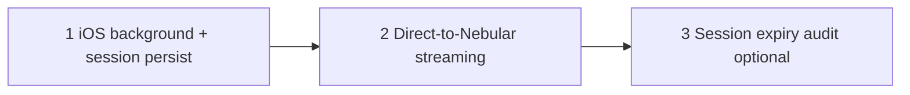

# Resumable upload — follow-up improvements

**Date:** 2026-06-18 (pruned — Phase A–D removed)  
**Status:** Web + iOS chunked uploads shipped for core paths. This doc tracks **remaining** work only.  
**Audience:** Maintainers planning the next upload reliability pass.

**Shipped baseline (omitted here):**

- Web MVP: chunked uploads (`029_upload_sessions.sql`), `POST/GET/PUT/POST /uploads/*`, shared `upload_finalize`, Vitest + integration tests.
- Janitor protection for `ownly_upload_{session_id}` while `upload_sessions.status` is `active`/`completing` (`temp_cleanup.rs`, `uploads/store.rs`).
- Session expiry sweeper — abort expired rows and delete spool dirs on janitor pass (audit logging not yet added — see §3 below).
- Append-on-write — parts seek-write into `source` (~1× disk peak; legacy `parts/` fallback retained).
- Web: `video/*` threshold **8 MiB**, non-video **32 MiB**; **2** parallel part PUTs; reload **Choose file** resume UX.
- iOS: chunked `POST/PUT/POST /uploads/*` for large/video files, 2 parallel parts, `DELETE /uploads/{id}` on cancel (no background `URLSession` or app-kill resume yet — see §2 below).

See git history and [`improvement-roadmap.md`](improvement-roadmap.md) executive summary.

---

## Ownly-specific constraints

Improvements should preserve:

1. **HLS playback** — upload spool must remain available through finalize and video ingest.
2. **Self-hosted ops** — janitor and expiry must not delete in-flight sessions (shipped in `temp_cleanup.rs`; verify manually per scenarios below when changing that code).
3. **Nebular boundary** — storage multipart changes belong in [AsP3X/nebular-os](https://github.com/AsP3X/nebular-os); Ownly integration stays in this repo per `nebular-os-vendor.mdc`.

---

## Remaining work

### 1. Stream parts to Nebular instead of spooling on the API

**Priority:** P2 (when API disk is the bottleneck)  
**Effort:** Large

**Problem:** Bytes still land on the API host, then go to object storage. Multi‑GiB uploads stress self-hosted API disk and memory even with append-on-write.

**Direction:**

- Client uploads chunks; API validates auth, quota, and session state.
- Bytes go **directly to object storage** (Nebular multipart when exposed upstream, or signed part URLs from Ownly).
- API registers metadata on `complete` only.

**Ownly scope:** `backend/src/storage/`, upload handlers, Compose env.  
**Nebular scope:** multipart API behavior in upstream repo; bump submodule pointer after merge.

**Verification:** Upload multi‑GiB file; API host peak disk stays bounded (no full-file spool).

---

### 2. iOS — background upload and session persistence across app kill

**Priority:** P2  
**Effort:** Medium

**Problem:** iOS uses chunked upload for large/video files, but does not yet use `URLSession` background configuration or persist the server `session_id` across app termination. Killing the app mid-upload still loses local progress unless the user retries manually.

**Direction:**

- `URLSessionConfiguration.background` (where appropriate) for part PUTs.
- Persist server `session_id` + file metadata in app storage; on relaunch, resume from `GET /uploads/{id}` part list when the temp file copy still exists (or prompt re-pick like web).

**Key files:** `ios/Ownly/Core/API/UploadService.swift`, `ios/Ownly/Features/Upload/UploadManager.swift`

**Verification:** Upload > 32 MiB video; kill app mid-upload; relaunch — upload continues without restarting from byte zero.

---

### 3. Optional — audit log on session expiry

**Priority:** P3  
**Effort:** Small

**Problem:** The janitor aborts expired sessions but does not write `audit_logs` rows.

**Direction:** `audit::write_audit` with action `uploads.session.expire` when the sweeper aborts a session (no secrets in `context`).

**Key files:** `backend/src/temp_cleanup.rs`, `backend/src/audit.rs`

---

## Suggested implementation order

| Phase | Focus | Why |
|-------|-------|-----|
| **A** | iOS background + persisted server session | Closes the last mobile reliability gap without Nebular changes |
| **B** | Direct-to-storage | Ops scale when API disk becomes limiting |
| **C** | Expiry audit | Observability only |

---

## Deprioritize for now

| Idea | Reason |
|------|--------|
| **TUS protocol** | Custom session API already works; adds dependency without clear win |
| **Resume after reload without re-picking file** | Browser security prevents access to `File` bytes; web **Choose file** UX shipped |
| **Lower chunk size globally** | More requests and DB rows; tune only if proxies misbehave |
| **Content-hash dedup at complete** | Tracked in [`storage-disk-improvements.md`](storage-disk-improvements.md) §2 |

---

## Related documents

- [`improvement-roadmap.md`](improvement-roadmap.md) — §1.2 resumable follow-ups summary
- [`storage-disk-improvements.md`](storage-disk-improvements.md) — lazy `export.mp4`, dedup, HLS cleanup (API/Nebular disk pressure)
- [`storage-disk-tuning.md`](storage-disk-tuning.md) — API / Nebular disk pressure
- [`.cursor/rules/nebular-os-vendor.mdc`](../.cursor/rules/nebular-os-vendor.mdc) — Nebular integration boundaries
