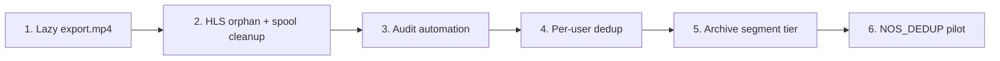

# Storage disk savings — follow-up improvements

**Date:** 2026-06-18  
**Status:** Planned — not yet implemented.  
**Audience:** Maintainers reducing Nebular disk use without breaking playback, download, or upload flows.

**Roadmap link:** [§6 Storage and scale](improvement-roadmap.md#6-storage-and-scale) in [`improvement-roadmap.md`](improvement-roadmap.md).

---

## Executive summary

Ownly already saves disk on **compressible** file types via Nebular **NOSI** block zstd (see [`storage-disk-tuning.md`](storage-disk-tuning.md)). The largest **Ownly-side** gaps are:

| Area | Today | Opportunity |
|------|-------|-------------|
| **Video HLS** | Segments + manifest + init; optional `export.mp4` sidecar | Stop persisting `export.mp4` unless requested; optional longer segments for cold/archive tier |
| **Duplicate uploads** | `content_hash` preflight warns; each upload still gets its own blob | **Per-user dedup** — share `storage_key` + refcount |
| **Orphans** | `storage-audit.py` is manual | Automate audit + alert; sweep failed HLS prefixes and stale spools |
| **Nebular block dedup** | `NOS_DEDUP_ENABLED=false` by default | Ops toggle — complements Ownly dedup, not a substitute |

This document is the detailed plan for those items.

---

## Ownly-specific constraints

Improvements should preserve:

1. **HLS playback** — encrypted fMP4 segments; range-friendly; no whole-file re-read for seeks.
2. **Download UX** — HLS-stored videos need an MP4 export path; can be **on-demand** + cache, not always-on disk.
3. **Quota honesty** — dedup must not under-count logical `files.size_bytes` per user.
4. **Delete safety** — shared blobs purge only when refcount hits zero (including recycle bin / soft delete).
5. **Nebular boundary** — block dedup and zstd live in [AsP3X/nebular-os](https://github.com/AsP3X/nebular-os); Ownly owns metadata, refcount, and export policy per `nebular-os-vendor.mdc`.

---

## High impact (do first)

### 1. Skip persisting `export.mp4` until explicitly requested

**Problem:** HLS vault videos store segments under `{storage_key}/segments/*.m4s`. A remuxed `{storage_key}/export.mp4` can be **as large as the full video** — duplicating logical size on disk. Download already uses `POST /api/v1/files/{id}/export` to queue export on demand, but other paths **persist** `export.mp4` today:

- `video/thumbnail_job.rs` — when the upload spool is gone, calls `run_hls_export_job` (writes Nebular object) if local segment remux fails.
- `files/zip_job.rs` — `ensure_hls_export_ready` runs export before zip download.
- Thumbnail regeneration after HLS ready may reuse cached `export.mp4`.

**Direction:**

- **Ephemeral remux for ffmpeg only** — prefer `materialize_hls_mp4_for_ffmpeg` (local temp) for thumbnails; never PUT to Nebular from thumbnail worker unless user triggered export.
- **Persist `export.mp4` only when:**
  - User calls `POST …/export` (download), or
  - Zip/folder download explicitly needs a member file (stream into zip without caching sidecar when possible).
- **TTL eviction** — optional `app_settings` or per-file `download_export_expires_at`; janitor deletes `{storage_key}/export.mp4` when idle (e.g. 7 days) while keeping HLS bundle.
- **UI** — download tray already polls export status; no change for explicit download. Zip may show “preparing export…” per file.

**Key files:** `backend/src/hls/export_job.rs`, `backend/src/hls/handlers.rs`, `backend/src/video/thumbnail_job.rs`, `backend/src/files/zip_job.rs`, `backend/src/files/file_delete.rs` (purge list already includes `export.mp4`)

**Verification:**

- Upload video, wait for HLS + thumbnails — **no** `export.mp4` in Nebular (`list_keys` under prefix).
- `POST /export` → MP4 appears; download succeeds.
- Zip containing HLS video completes without leaving permanent `export.mp4` (or evicts after job).
- Re-run `scripts/storage-audit.py` — logical vs on-disk gap shrinks on video-heavy libraries.

**Effort:** Medium.

---

### 2. Per-user content deduplication (`content_hash` → shared `storage_key`)

**Problem:** Every upload computes SHA-256 (`content_hash.rs`) and duplicate preflight warns (`check_upload_content_hash_duplicates`), but finalize always allocates a new `storage_key` and PUTs bytes again.

**Direction:**

- On finalize (simple + resumable complete), after hashing:
  - `SELECT storage_key, id FROM files WHERE user_id = $1 AND content_hash = $2 AND deleted_at IS NULL LIMIT 1`
  - If hit: insert new `files` row with **same** `storage_key` (new `id`, name, folder); **skip** Nebular PUT and derivative jobs when sidecars already exist (video HLS, thumbnails, waveform).
  - If miss: current path.
- **Refcount table** (recommended): `storage_blob_refs(storage_key, ref_count)` or count live `files` rows per key; increment on deduped insert; decrement on permanent delete.
- **Delete:** `purge_file_storage` only when no remaining `files` rows reference `storage_key` (and recycle bin empty for that row).
- **Quota:** still charge full `size_bytes` per `files` row (user expectation for “two copies” in different folders) **or** document “deduped copies share quota” — pick one policy in admin settings.
- **Audit:** `files.upload` context `{ "deduped": true, "source_file_id": "…" }`.
- **Video edge case:** second row pointing at HLS bundle must not re-queue `HlsEncode` if `hls_ready` on source key.

**Key files:** `backend/src/files/upload_finalize.rs`, `backend/src/uploads/handlers.rs` (complete), `backend/src/files/file_delete.rs`, `backend/src/files/listing.rs`, new migration `0NN_storage_blob_refs.sql`

**Verification:**

- Upload same 10 MiB file twice (different names) — one Nebular object, two `files` rows, both downloadable.
- Delete one row — blob remains; delete both — blob purged.
- Upload duplicate while first is in recycle bin — define policy (treat as miss or restore prompt); test documented behavior.

**Effort:** Medium–large.

**Relation to versioning (roadmap §1.5):** Version rows with unchanged `content_hash` should share `storage_key` by default.

---

### 3. Orphan blob audit automation

**Problem:** `scripts/storage-audit.py` compares Postgres logical `files.size_bytes` to on-disk Nebular blobs but is **manual**. Gaps often mean orphaned segments from failed HLS, incomplete deletes, or legacy nested paths.

**Direction:**

- **Scheduled job** — Cron/K8s/`background_jobs` runner executes audit weekly; logs summary metrics (logical_bytes, on_disk_bytes, delta_pct, nosi vs raw counts).
- **Alert** — when `|logical - on_disk| / logical > threshold` (e.g. 15%) or orphan key count > N.
- **Admin UI** — “Storage health” card: last audit time, delta, link to run migration (`migrate-storage-blobs.sh`).
- **Optional repair pass** — list keys under Nebular with no owning `files.storage_key` prefix; dry-run delete with admin confirm (destructive — gated).

**Key files:** `scripts/storage-audit.py`, new `backend/src/admin/storage_audit.rs` or extend `admin/storage_migration.rs`, `frontend` admin console

**Verification:**

- Inject orphan blob in test fixture; audit reports drift.
- CI job runs audit against compose stack with zero drift after clean upload/delete.

**Effort:** Small–medium.

---

## Medium impact

### 4. Clean up failed / cancelled HLS ingest (API spool + partial Nebular prefixes)

**Problem:**

- **API temp:** `temp_cleanup.rs` protects `ownly_upload_*` while `hls_encode_status IN ('queued','processing')` but failed/cancelled rows may leave spools longer than needed if status updated without cleanup.
- **Nebular:** `encode_job.rs` calls `purge_file_storage` on segment upload failure; cancelled encode also purges. Partial success (some segments PUT) before crash may leave `{storage_key}/segments/*` without `hls_ready` — no periodic sweeper.

**Direction:**

- On `hls_encode_status` → `failed` | `cancelled`, schedule spool cleanup and **list+delete** partial prefix under `{storage_key}/` (segments, init, playlist — not thumbnails if any were written).
- Extend temp janitor: if video row `failed`/`cancelled` and spool idle > TTL, remove `ownly_upload_{file_id}`.
- Background job: `files` where `mime LIKE 'video/%' AND NOT hls_ready AND hls_encode_status IN ('failed','cancelled') AND updated_at < now() - interval '24 hours'` → purge storage prefix + audit `files.hls.cleanup_orphan`.

**Key files:** `backend/src/temp_cleanup.rs`, `backend/src/hls/encode_job.rs`, `backend/src/files/file_delete.rs` (`purge_file_storage`), `backend/src/jobs/recovery.rs`

**Verification:**

- Force HLS failure mid-segment-upload; sweeper removes partial segments; audit shows no orphan keys for that `storage_key`.
- Cancelled encode deletes upload spool within janitor window.

**Effort:** Medium.

---

### 5. Cold / archive HLS — longer segments (12s+)

**Problem:** Default segment target is **6s** (`HLS_SEGMENT_TARGET_SECS`); sources **> 500 MiB** already use **12s** (`HLS_LARGE_SOURCE_BYTES`). More segments ⇒ more objects and slightly worse encoder efficiency.

**Direction:**

- **Policy tiers** — env or `app_settings`:
  - `standard` — current behavior (6s / 12s large).
  - `archive` — always 12s (or 15s) segments; slightly higher CRF acceptable.
- **Per-user or instance default** for backup-heavy instances.
- **Playback** — unchanged (player uses manifest); first byte latency may rise slightly on archive tier.
- Document tradeoff in [`storage-disk-tuning.md`](storage-disk-tuning.md).

**Key files:** `backend/src/hls/playlist.rs`, `backend/src/hls/encoder.rs`, `backend/src/config.rs`, `.env.example`

**Verification:**

- Upload sub-500 MiB video with archive tier — segment count ≈ duration/12.
- Playback + share links work; storage-audit shows fewer segment objects per minute of video.

**Effort:** Small–medium.

---

### 6. Nebular block dedup (`NOS_DEDUP_ENABLED`)

**Problem:** Identical blocks across **different** object keys (copies, versions, repeated JSON) are stored twice at block level.

**Direction:**

- **Ops-only pilot** — enable on staging: `NOS_DEDUP_ENABLED=true`; monitor CPU and `storage-audit.py` on-disk bytes.
- **Not a substitute** for Ownly per-user `content_hash` dedup (metadata and quota still need Ownly refcount).
- **Complements** §2 when users keep multiple file rows with same bytes but different names.

**Key files:** `docker-compose.yml`, `.env.example`, upstream Nebular config (no submodule edits in this repo)

**Verification:**

- Upload two identical large compressible files (different keys) with dedup on — on-disk total < 2× logical for compressible types.

**Effort:** Small (ops); policy doc only in Ownly.

---

## Lower priority / policy decisions

### 7. Cross-user content deduplication

**Problem:** Same bytes uploaded by two users stores twice.

**Direction:** Defer unless instance is trusted multi-tenant with explicit opt-in. Requires:

- Global `content_hash` → `storage_key` map (or intern table).
- Quota: split billing vs single physical copy.
- Legal/isolation: user A must not infer user B’s file exists from timing or errors.
- Share/copy semantics when revoking one user’s file.

**Status:** Policy decision — see roadmap §1.5 versioning + §6. Track separately from per-user dedup (§2).

**Effort:** Very large.

---

## Suggested implementation order

| Order | Item | Why |
|-------|------|-----|
| 1 | Lazy `export.mp4` | Immediate video disk win; no schema change |
| 2 | HLS / spool cleanup | Stops leak from failed ingests |
| 3 | Audit automation | Measures everything else |
| 4 | Per-user dedup | Highest structural win for backup/sync |
| 5 | Archive segments | Tunable policy |
| 6 | Nebular dedup | Ops toggle after Ownly metadata is sound |

---

## Verification checklist (release gate)

- [ ] `python scripts/storage-audit.py` — delta within threshold on test library with videos + duplicates
- [ ] `cargo test -p ownly-backend` — upload finalize, delete, HLS regression tests green
- [ ] Manual smoke: upload video → play HLS → download MP4 (on demand) → delete → blob gone
- [ ] Duplicate upload smoke (after §2): two names, one blob, safe delete
- [ ] `npm run build` if admin storage health UI added

---

## Related documents

| Topic | Location |
|-------|----------|
| zstd / HLS env tuning | [`docs/storage-disk-tuning.md`](storage-disk-tuning.md) |
| Improvement roadmap §6 | [`docs/improvement-roadmap.md`](improvement-roadmap.md) |
| Resumable upload disk pressure | [`docs/resumable-upload-improvements.md`](resumable-upload-improvements.md) |
| Content hash migration | `backend/migrations/postgres/021_file_content_hash.sql` |
| Storage audit script | [`scripts/storage-audit.py`](../scripts/storage-audit.py) |
