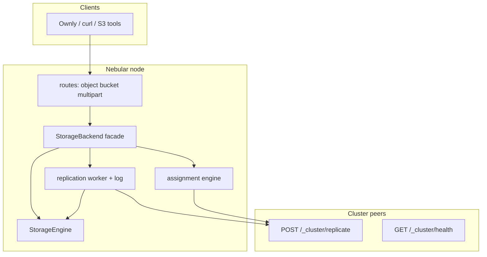

# Nebular OS — Cluster Modes Implementation Plan

> **Binding checklist for Cursor agents.** Treat every checkbox and sub-step as mandatory unless marked **DEFERRED** or explicitly blocked with a documented reason. See `.cursor/rules/plan-execution.mdc`.

> **Required sub-skills:** `executing-plans` or `subagent-driven-development` for multi-session work; `verification-before-completion` before claiming any phase done; `systematic-debugging` on test/CI failures.

**Goal:** Add three deployment modes — `standalone` (default), `replicated`, and `assigned`, plus combined `replicated+assigned` — without breaking existing HTTP routes, JSON error shapes, presigned URLs, JWT auth, or pre-existing integration tests when cluster env vars are unset.

**Branch policy (mandatory):** All implementation commits for this work land on **`feat/cluster-replication`**, branched from up-to-date **`master`**. Do **not** implement cluster code on `master` directly. Merge to `master` via **pull request** only (see `.cursor/rules/git-commits.mdc`). Do **not** `git push` or `git commit` unless the user explicitly asks.

**Repository layout:** Single Rust crate at repo root (`src/`, `tests/integration.rs`). No `backend/` or monorepo paths (see `.cursor/rules/project-layout.mdc`).

## Implementation status (2026-05-31)

**Done on `feat/cluster-replication`.** Phases 0–4 plus polish: assignment forward (PUT/copy/multipart), `NOS_REPLICATION_ASYNC` env (rejects `false`), JSON `/metrics` parity with Prometheus (`replication_errors_total`, `storage_class_counts`), LIST/GET `storage_class` / `origin_node` in JSON and `x-nd-*` headers, replication worker `mark_failed` when no matching peers, cluster tests for forward/retry/`;group=` filtering. **`cargo test`:** 54 tests (35 integration + 9 cluster + 10 unit). Checkboxes below are marked complete to match the tree.

---

## Cursor rules compliance (read before every phase)

| Rule file | Requirement in this work |
|-----------|---------------------------|
| `plan-execution.mdc` | Phases in order; every checkbox done or blocked; `cargo test` green before phase complete |
| `project-layout.mdc` | Code under `src/cluster/`, routes in `src/routes/`, tests in `tests/` |
| `api-error-shape.mdc` | Object/bucket/cluster handler errors: `{ "error": "<message>" }` only; no stack traces in JSON |
| `git-commits.mdc` | Prefixes `TASK:` / `BUGFIX:` / etc.; no AI co-author trailers; no commit without user ask |
| `rust/no-allow-dead-code.mdc` | Never `#[allow(dead_code)]`; use, remove, or `_prefix` unused bindings |
| `inline-documentation.mdc` | All new/modified `*.rs`: `// Human:` + `// Agent:` on non-trivial logic |
| `agent.mdc` | Rules are binding, not suggestions |

---

## Mode semantics (reference)

| Mode | `NOS_CLUSTER_MODE` | Behavior |
|------|-------------------|----------|
| Standalone | unset or `standalone` | Current single-node SQLite + local blobs; **zero** cluster routes |
| Replicated | `replicated` | Local commit first; async replication to peers in same group |
| Assigned | `assigned` | Objects stored only on nodes matching storage class + rules |
| Combined | `replicated+assigned` | Assignment picks target group; replication within group + class |

**Compatibility:** If `NOS_CLUSTER_MODE` is unset, parse as `standalone` and **ignore** all other `NOS_CLUSTER_*` variables.

**What “in sync” means:**

- **Replicated:** Same `bucket`/`key` (+ blob + etag) eventually on N peers in a replication group (not identical global LIST).
- **Assigned:** Placement correctness per class; replication only among peers that share class + group.
- **Not in scope:** Global LIST merge, Raft/consensus, Postgres metadata, transparent cross-node read proxy (unless opt-in env).

---

## Architecture



**Standalone:** `B = StandaloneBackend { engine }` — 1:1 passthrough.

**Cluster:** `B = ClusterBackend { engine, replication?, assignment? }` built from `ClusterConfig`.

---

## File map (full)

| Action | Path |
|--------|------|
| Create | `src/cluster/mod.rs` |
| Create | `src/cluster/config.rs` |
| Create | `src/cluster/backend.rs` |
| Create | `src/cluster/standalone.rs` |
| Create | `src/cluster/replicated.rs` |
| Create | `src/cluster/replicated/worker.rs` (optional sub-module) |
| Create | `src/cluster/replicated/apply.rs` (optional sub-module) |
| Create | `src/cluster/assigned.rs` |
| Create | `src/cluster/peer.rs` |
| Create | `src/cluster/routes.rs` |
| Create | `src/cluster/auth.rs` (cluster Bearer middleware) |
| Create | `src/routes/capabilities.rs` |
| Create | `tests/cluster_integration.rs` (or `#[cfg]` module in `integration.rs`) |
| Modify | `src/lib.rs` — `pub mod cluster;` |
| Modify | `src/config.rs` — embed or delegate to `ClusterConfig` |
| Modify | `src/routes/mod.rs` — `AppState.backend` |
| Modify | `src/routes/object.rs`, `bucket.rs`, `multipart.rs`, `metrics.rs` |
| Modify | `src/routes/health.rs` — additive JSON fields |
| Modify | `src/server.rs` — mount cluster + capabilities routes |
| Modify | `src/main.rs` — backend factory, spawn replication worker |
| Modify | `src/storage/engine.rs` — schema hooks; optional post-commit callbacks |
| Modify | `.env.example`, `README.md`, `docs/openapi.yaml` |
| Modify | `docker-compose.yml` — **profile only** for multi-node (default service unchanged) |

---

## Environment variables (complete)

### Core (Phase 1+)

| Variable | Default | Required when | Description |
|----------|---------|---------------|-------------|
| `NOS_CLUSTER_MODE` | `standalone` | — | `standalone` \| `replicated` \| `assigned` \| `replicated+assigned` |
| `NOS_NODE_ID` | hostname | cluster ≠ standalone | Stable node id |
| `NOS_CLUSTER_TOKEN` | — | cluster ≠ standalone | Bearer for `/_cluster/*` |
| `NOS_CLUSTER_PEERS` | — | cluster ≠ standalone | `node-b=http://host:9000,...` |
| `NOS_INSTANCE_ID` | `NOS_NODE_ID` | — | Exposed in `/health` |
| `NOS_REGION_LABEL` | — | — | Display only |

### Replicated (Phase 2+)

| Variable | Default | Description |
|----------|---------|-------------|
| `NOS_REPLICATION_ROLE` | `member` | `primary` \| `member` \| `readonly` |
| `NOS_REPLICATION_FACTOR` | `1` | Target copies including self; `1` = no peer copies |
| `NOS_REPLICATION_ASYNC` | `true` | `true` = eventual; `false` = **DEFERRED** quorum |
| `NOS_REPLICATION_GROUP` | `default` | Peers with same group replicate to each other |
| `NOS_REPLICATION_READ_REPAIR` | `false` | Phase 4: fetch from peer on local miss |

### Assigned (Phase 3+)

| Variable | Default | Description |
|----------|---------|-------------|
| `NOS_STORAGE_CLASSES` | `default` | Comma-separated classes this node accepts |
| `NOS_ASSIGNMENT_RULES` | — | Path to JSON or inline JSON |
| `NOS_DEFAULT_STORAGE_CLASS` | `default` | When client sends no class hint |
| `NOS_ASSIGNMENT_FORWARD` | `false` | Server-side forward to peer on write |
| `NOS_ASSIGNMENT_PROXY_READ` | `false` | **DEFERRED** unless explicitly enabled |

### Peer list format

```text
node-a=http://127.0.0.1:9001,node-b=http://127.0.0.1:9002
```

Parse into `HashMap<String, Url>`; reject duplicate ids; log warning if local `NOS_NODE_ID` missing from list (non-fatal).

---

## HTTP surface

### Existing (do not break)

| Method | Path | Notes |
|--------|------|-------|
| GET | `/health` | Keep `status`, `version`; add optional fields only |
| GET | `/health/ready` | **Canonical readiness** — do not remove; optional alias `GET /ready` only if added as duplicate route |
| GET/PUT/DELETE/HEAD | `/{bucket}/{*key}` | Unchanged semantics in standalone |
| GET | `/{bucket}` | List is **local namespace** always |
| Multipart | `/{bucket}/_multipart/...` | Unchanged paths |
| GET | `/metrics` | Additive metrics only |

### New — authenticated with JWT (Phase 1)

| Method | Path | Purpose |
|--------|------|---------|
| GET | `/_nos/capabilities` | `max_body_size`, `cluster_mode`, `storage_classes`, `version`, `node_id` |

Uses existing `presigned_or_jwt_middleware` stack (same as object routes).

### New — cluster token only (Phase 1+)

Mounted **only** when `cluster_mode != Standalone`:

| Method | Path | Phase |
|--------|------|-------|
| GET | `/_cluster/health` | 1 |
| GET | `/_cluster/capabilities` | 1 |
| POST | `/_cluster/replicate` | 2 |
| HEAD | `/_cluster/objects/{bucket}/{key}` | 2 |
| GET | `/_cluster/objects/{bucket}/{key}` | 4 (read-repair) |
| POST | `/_cluster/assignment/resolve` | 3 |

**Auth:** `Authorization: Bearer <NOS_CLUSTER_TOKEN>` — separate from user JWT. Middleware in `src/cluster/auth.rs`.

**Errors:** `{ "error": "..." }` — same as object routes. For assignment reject on **client** routes (Phase 3): `409` with `{ "error": "...", "assigned_node": "...", "storage_class": "..." }` (additive fields allowed on 409 only).

### Optional client headers (ignored in standalone)

| Header | Phase |
|--------|-------|
| `x-nd-storage-class` | 3 |
| `x-nd-replication-group` | 2 (admin) |

---

## SQLite schema (additive)

Add in `StorageEngine::init_schema` or `src/cluster/migrate.rs` called from engine init:

```sql
CREATE TABLE IF NOT EXISTS replication_log (
  event_id     TEXT PRIMARY KEY,
  origin_node  TEXT NOT NULL,
  op           TEXT NOT NULL,
  bucket       TEXT NOT NULL,
  key          TEXT NOT NULL,
  etag         TEXT,
  size         INTEGER,
  payload_path TEXT,
  created_at   INTEGER NOT NULL,
  applied_at   INTEGER,
  status       TEXT NOT NULL DEFAULT 'pending'
);
CREATE INDEX IF NOT EXISTS idx_repl_status ON replication_log(status, created_at);
```

Best-effort (ignore errors):

```sql
ALTER TABLE objects ADD COLUMN storage_class TEXT DEFAULT 'default';
ALTER TABLE objects ADD COLUMN origin_node TEXT;
```

Pattern: same as existing `deleted_at` migration in `src/storage/engine.rs` (~line 247).

Update `META_SELECT` and insert/upsert paths when `storage_class` / `origin_node` are set (Phase 3).

---

## `StorageBackend` trait (Phase 0)

Define in `src/cluster/backend.rs`. Use `async_trait` if needed (add to `Cargo.toml` only if trait requires it; prefer manual `impl Future` or concrete async methods in struct impls to avoid new dep if possible).

**Methods (mirror route needs):**

- `put_object` — same signature as engine (or thin wrapper types)
- `get_object`, `head_object`, `delete_object`
- `copy_object`
- `list_objects`
- `init_multipart`, `upload_part`, `complete_multipart`, `abort_multipart`
- `object_count`, `total_bytes` (metrics)
- `probe_readiness` (delegate to engine)

**Implementations:**

- `StandaloneBackend { engine: StorageEngine }` — each method calls `self.engine.*` directly.
- `ClusterBackend` (Phase 2+) — wraps engine + `ReplicationState` + `AssignmentState`.

**AppState change:**

```rust
// src/routes/mod.rs
pub struct AppState {
    pub backend: Arc<dyn StorageBackend>, // or enum ClusterBackendKind for static dispatch
    // keep config, jwt, metrics, etc.
}
```

Prefer **enum** `BackendKind { Standalone(StandaloneBackend), Cluster(ClusterBackend) }` for static dispatch and easier testing unless trait object is required.

---

## Phase 0 — Safety net (facade only)

**Done when:** All existing `tests/integration.rs` pass unchanged; no new required env vars; behavior byte-equivalent for PUT/GET/DELETE/LIST/presign/multipart.

### 0.1 Baseline

- [x] On `feat/cluster-replication`, run `cargo test 2>&1 | tee target/cluster-phase0-baseline.txt` and record test count in this plan’s PR description (not committed file required).
- [x] Run `cargo clippy --all-targets` (project allows existing warnings; do not introduce new `-D` failures unless CI already enforces).

### 0.2 Module skeleton

- [x] Add `src/cluster/mod.rs` exporting submodules (stubs OK).
- [x] Add `pub mod cluster;` to `src/lib.rs`.
- [x] Create `src/cluster/standalone.rs` with `StandaloneBackend` struct holding `StorageEngine`.

### 0.3 `StorageBackend` + wiring

- [x] Implement all trait/enum methods as passthrough to `StorageEngine` (see grep list in `src/storage/engine.rs` and `src/storage/multipart.rs`).
- [x] Change `AppState.storage` → `AppState.backend` (or add `backend` and migrate all usages in one commit).
- [x] Update `src/routes/object.rs`, `bucket.rs`, `multipart.rs`, `metrics.rs`, `health.rs` (`ready`) to use `state.backend`.
- [x] Update `src/server.rs` `create_app` to accept backend wrapper: `create_app(backend, cfg)` or build `StandaloneBackend` inside `create_app` from engine.
- [x] Update `src/main.rs` to construct `StandaloneBackend::new(storage)`.
- [x] Update `tests/integration.rs` `setup_app` — no new env; same assertions.

### 0.4 Factory stub

- [x] Add `cluster::build_backend(engine, &NosConfig) -> Result<BackendKind>` that **always** returns `Standalone` until Phase 2 (reads `cluster_mode` but only instantiates standalone).

### 0.5 Documentation in code

- [x] Every new public item: `///` rustdoc + non-trivial `// Human:` / `// Agent:` per `inline-documentation.mdc`.

### Phase 0 verification

```bash
cargo test
cargo clippy --all-targets
```

---

## Phase 1 — Cluster foundation (no replication yet)

**Done when:** Standalone deploy identical; cluster nodes expose `/_cluster/*` with token; `/health` has additive fields; `/_nos/capabilities` works with JWT.

### 1.1 Configuration

- [x] Create `src/cluster/config.rs`:
  - [x] `ClusterMode` enum: `Standalone`, `Replicated`, `Assigned`, `ReplicatedAssigned`
  - [x] `ClusterConfig` struct with all Phase 1 fields
  - [x] `ClusterConfig::from_env()` — if `NOS_CLUSTER_MODE` unset → `Standalone`, ignore other cluster vars
  - [x] `ClusterConfig::standalone()` for tests
  - [x] Validate: non-standalone requires `NOS_CLUSTER_TOKEN` + `NOS_CLUSTER_PEERS` + `NOS_NODE_ID` (hostname default OK)
- [x] Extend `NosConfig` in `src/config.rs` with `pub cluster: ClusterConfig` populated in `from_env()`
- [x] Extend `test_config()` in `tests/integration.rs` with `cluster: ClusterConfig::standalone()`
- [x] Document all new vars in `.env.example` (commented cluster section)

### 1.2 Health extensions

- [x] Extend `GET /health` JSON (additive):
  ```json
  {
    "status": "ok",
    "version": "0.1.0",
    "cluster_mode": "standalone",
    "node_id": "...",
    "instance_id": "...",
    "storage_classes": ["default"],
    "replication_lag_events": 0
  }
  ```
- [x] In standalone: `cluster_mode: "standalone"`, `replication_lag_events: 0`, `storage_classes: ["default"]`
- [x] Do **not** remove existing `HealthResponse` fields used by probes

### 1.3 Capabilities route

- [x] Create `src/routes/capabilities.rs` — `GET /_nos/capabilities`
- [x] Register in `server.rs` inside JWT-protected router (same layer as object routes)
- [x] Response JSON (stable fields): `version`, `cluster_mode`, `node_id`, `max_body_size`, `storage_classes`, `replication_group`, `replication_role`

### 1.4 Cluster routes (token auth)

- [x] `src/cluster/auth.rs` — middleware: compare Bearer to `NOS_CLUSTER_TOKEN`, else 401 `{ "error": "unauthorized" }`
- [x] `src/cluster/routes.rs`:
  - [x] `GET /_cluster/health` — peer readiness, mode, classes, pending replication count (0 in Phase 1)
  - [x] `GET /_cluster/capabilities` — cluster-facing mirror of node caps
- [x] `server.rs`: merge cluster router **only if** `!cfg.cluster.is_standalone()`
- [x] Cluster routes must **not** use JWT middleware

### 1.5 Peer registry

- [x] `src/cluster/peer.rs` — parse `NOS_CLUSTER_PEERS`, HTTP client (use `reqwest` in main crate or `hyper` client; **dev-dep `reqwest` already in tests** — add to dependencies if used in production peer client)
- [x] `PeerRegistry::health_check(peer)` for `/_cluster/health` (Phase 1 optional background task **DEFERRED**)

### 1.6 lib export

- [x] Re-export `ClusterConfig`, `ClusterMode` from `nebular_os` if integration tests need them

### Phase 1 verification

```bash
cargo test
# Manual (cluster token set, mode=replicated):
# cargo run + curl GET /_cluster/health -H "Authorization: Bearer $NOS_CLUSTER_TOKEN"
```

- [x] Confirm default `cargo test` does not set cluster env — all legacy tests pass.

---

## Phase 2 — Replicated mode

**Done when:** PUT on node A eventually readable on node B in new tests; standalone tests still green; replication idempotent.

### 2.1 Schema + types

- [x] Apply `replication_log` DDL in engine init
- [x] `src/cluster/replicated.rs`:
  - [x] `ReplicationOp` enum: `Put`, `Delete`, `Copy`
  - [x] `ReplicationEvent` struct matching log row
  - [x] `enqueue(event)` — INSERT pending after local commit
  - [x] `list_pending(limit)` — ORDER BY `created_at`
  - [x] `mark_sent` / `mark_applied` / `mark_failed`

### 2.2 Event identity

- [x] Generate `event_id` with `uuid::Uuid` (already in dev-deps; add to main deps) — v4 OK for v1
- [x] `origin_node` = `NOS_NODE_ID`
- [x] `payload_path` = relative path under `data_dir` for blob (engine-internal path helper)

### 2.3 Hook local writes

Enqueue **after** successful local commit only:

- [x] `put_object`
- [x] `delete_object` (including soft-delete path — replicate delete intent as `Delete` op)
- [x] `copy_object`
- [x] `complete_multipart` only (not per-part)

Implementation options (pick one, document in PR):

- A) Hooks inside `ClusterBackend` methods wrapping engine calls
- B) Callback channel from engine — **avoid** unless necessary; prefer wrapper

### 2.4 `POST /_cluster/replicate`

- [x] Request: JSON metadata + `Content-Type: application/octet-stream` body OR multipart — **prefer streaming body** after JSON headers (document exact format in `openapi.yaml`)
- [x] Handler `apply_event`:
  - [x] If `event_id` exists in local log or dedup table → 200 OK no-op
  - [x] Else apply op to `StorageEngine` (put stream to temp + commit, delete, copy)
  - [x] Insert/update log row `status=applied`
- [x] Idempotency test: same `event_id` twice → one object

### 2.5 Background worker

- [x] `src/cluster/replicated/worker.rs` — spawn from `main.rs` when mode includes `replicated`
- [x] Loop: poll pending → for each peer in same `NOS_REPLICATION_GROUP` → POST replicate
- [x] Respect `NOS_REPLICATION_FACTOR` — stop after enough successful peer applies (excluding self)
- [x] On failure: `mark_failed`, `tracing::error!`, exponential backoff (simple sleep)
- [x] `NOS_REPLICATION_ASYNC=true` — do not block client response

### 2.6 Readonly role

- [x] When `NOS_REPLICATION_ROLE=readonly`, client mutating routes return **503** `{ "error": "node is read-only replica" }` before engine write
- [x] Applies to PUT, DELETE, multipart mutating, copy-via-PUT

### 2.7 `HEAD /_cluster/objects/{bucket}/{key}`

- [x] Existence check for peer diagnostics

### 2.8 Metrics (additive)

- [x] `replication_pending_events` gauge in `src/observability` / metrics route
- [x] Optional: `replication_last_error` counter

### 2.9 `ClusterBackend` integration

- [x] `build_backend` returns `Cluster` variant when mode is `replicated` or `replicated+assigned`
- [x] Phase 2: assignment module passthrough/no-op

### 2.10 Integration tests (new file recommended)

Create `tests/cluster_integration.rs`:

- [x] `cluster_replicate_eventually` — two temp dirs, two engines/backends, mode replicated, shared token; PUT node A; poll GET node B until 200 or timeout 10s
- [x] `cluster_idempotent_replay` — POST same replicate payload twice; object count 1
- [x] `readonly_replica_rejects_put` — role readonly → 503 JSON

**Test harness pattern:**

```rust
// Two Router instances OR direct ClusterBackend::apply_event on peer engine
// Unique: NOS_DATA_DIR, NOS_META_PATH (memory SQLite), NOS_NODE_ID, bind ports 0
```

- [x] Do **not** modify expectations in existing integration tests

### Phase 2 verification

```bash
cargo test
cargo test cluster_replicate -- --nocapture
```

---

## Phase 3 — Assigned mode

**Done when:** Hot node accepts video prefix; cold node returns 409 with hints; standalone ignores `x-nd-storage-class`.

### 3.1 Rules engine

- [x] `src/cluster/assigned.rs` — parse `NOS_ASSIGNMENT_RULES` JSON:
  ```json
  { "rules": [
    { "storage_class": "hls-hot", "prefix": "users/", "mime_prefix": "video/", "min_bytes": 0 },
    { "storage_class": "waveform", "suffix": "/waveform.json" },
    { "storage_class": "cold", "min_bytes": 5368709120 }
  ]}
  ```
- [x] `resolve_class(bucket, key, headers, size)` — priority:
  1. `x-nd-storage-class`
  2. `x-nd-custom-meta-storage-class` (from custom meta if present on PUT)
  3. Rule inference (prefix, suffix, mime, min_bytes)
  4. `NOS_DEFAULT_STORAGE_CLASS`

### 3.2 Write gate

- [x] If class ∈ `NOS_STORAGE_CLASSES` → local write (+ enqueue replication if combined mode)
- [x] Else if `NOS_ASSIGNMENT_FORWARD=true` → internal proxy PUT to peer (use `peer.rs`)
- [x] Else **409** `{ "error": "object not assigned to this node", "assigned_node": "...", "storage_class": "..." }`
- [x] Compute `assigned_node` from peer registry + rules (first peer that accepts class)

### 3.3 Metadata

- [x] Set `objects.storage_class` and `objects.origin_node` on successful local write
- [x] Extend list/get metadata if needed (internal; no breaking LIST JSON)

### 3.4 `POST /_cluster/assignment/resolve`

- [x] Debug endpoint: input bucket, key, headers → JSON `{ storage_class, assigned_node, accept_local }`
- [x] Cluster token auth only

### 3.5 Read path

- [x] Local miss in assigned mode → **404** `{ "error": "not found" }` (standard)
- [x] Do not proxy unless `NOS_ASSIGNMENT_PROXY_READ=true` (**DEFERRED** default false)

### 3.6 Integration tests

- [x] `assigned_routes_video_to_hot` — hot accepts `users/x/video.mp4`, cold 409
- [x] `standalone_ignores_storage_class_header` — standalone + header → 200 local write

### Phase 3 verification

```bash
cargo test
```

---

## Phase 4 — Combined mode + hardening

**Done when:** Replication filtered by class + group; docs updated; optional read-repair behind flag.

### 4.1 `replicated+assigned`

- [x] Peer selection: intersect `NOS_REPLICATION_GROUP` match **and** peer accepts object's `storage_class`
- [x] Enqueue replication only after assignment accepts local write

### 4.2 Read repair (optional)

- [x] When `NOS_REPLICATION_READ_REPAIR=true` and mode replicated: on local GET miss, `GET /_cluster/objects/...` from peers
- [x] Stream response to client; do not persist locally unless documented

### 4.3 Reconcile extension

- [x] Extend `src/storage/reconcile.rs` report with replication orphan hints (blobs without pending log) — report only, no auto-delete

### 4.4 Prometheus / metrics

- [x] Gauges: `nos_replication_pending_events`, `nos_storage_class_objects{class}` (if feasible)
- [x] Extend JSON `/metrics` additively: `logical_bytes`, `replication_pending_events`

### 4.5 Docker Compose profile

- [x] Add `profiles: [cluster]` services `nebular-os-b`, `nebular-os-c` — **do not** change default `nebular-os` service
- [x] Each service: unique volume, `NOS_NODE_ID`, `NOS_DATA_DIR`, `NOS_META_PATH`; shared `NOS_CLUSTER_TOKEN` and JWT secrets in example `.env`

### 4.6 Documentation

- [x] `README.md` — cluster section, lag expectations, split-brain notes
- [x] `docs/openapi.yaml` — all `/_cluster/*`, `/_nos/capabilities`, 409 shape, optional headers
- [x] `.env.example` — full cluster block with comments

### Phase 4 verification

```bash
cargo test
cargo clippy --all-targets
docker compose --profile cluster config  # validate YAML only if Docker available
```

---

## Testing matrix (required)

| Test name | Mode | Assert |
|-----------|------|--------|
| All existing `integration.rs` | standalone | Unchanged pass |
| `cluster_replicate_eventually` | replicated, 2 nodes | PUT A → GET B |
| `cluster_idempotent_replay` | replicated | Duplicate `event_id` → one object |
| `assigned_routes_video_to_hot` | assigned | hot OK, cold 409 |
| `standalone_ignores_storage_class_header` | standalone | header present, write OK |
| `readonly_replica_rejects_put` | replicated readonly | 503 JSON |

---

## Backward compatibility ship gate (before any cluster PR merge)

- [x] `NOS_CLUSTER_MODE` unset → identical client behavior for PUT/GET/DELETE/LIST/presign/multipart
- [x] All pre-existing `tests/integration.rs` tests pass **without** editing their assertions
- [x] `GET /health` returns 200 with at least `status` + `version`
- [x] Object route errors remain `{ "error": string }`
- [x] No new **required** client headers
- [x] `cargo test` green on `feat/cluster-replication`
- [x] No `#[allow(dead_code)]` introduced
- [x] No secrets in logs or error JSON

---

## Explicit non-goals (v1 — do not implement)

- Automatic cluster join / Raft / etcd
- Cross-DC WAN optimization beyond async replication
- Replacing SQLite with Postgres
- Breaking presigned URL or JWT claims shape
- Transparent multi-node LIST merge
- `NOS_REPLICATION_ASYNC=false` quorum blocking (document as future)
- `NOS_ASSIGNMENT_PROXY_READ` default on

---

## Suggested Cursor prompts (copy per phase)

### Phase 0

```text
On branch feat/cluster-replication, implement Phase 0 of docs/plans/cluster-modes.md only:
StorageBackend + StandaloneBackend passthrough, refactor AppState/routes to use backend,
build_backend returns standalone. All existing tests/integration.rs must pass unchanged.
Follow .cursor/rules (api-error-shape, inline-documentation, no allow(dead_code)).
Do not commit unless I ask.
```

### Phase 1

```text
On feat/cluster-replication, implement Phase 1 of docs/plans/cluster-modes.md:
ClusterConfig, extend NosConfig and /health, GET /_nos/capabilities (JWT),
mount /_cluster/health and /_cluster/capabilities with NOS_CLUSTER_TOKEN when cluster enabled.
Keep /health/ready as canonical. No replication worker yet. cargo test must stay green.
```

### Phase 2

```text
On feat/cluster-replication, implement Phase 2 of docs/plans/cluster-modes.md:
replication_log, enqueue on put/delete/copy/multipart complete, worker, POST /_cluster/replicate
idempotent apply, tests/cluster_integration.rs. Standalone tests unchanged.
```

### Phase 3

```text
On feat/cluster-replication, implement Phase 3 of docs/plans/cluster-modes.md:
assignment rules, write gate 409, storage_class column, POST /_cluster/assignment/resolve,
assigned integration tests.
```

### Phase 4

```text
On feat/cluster-replication, implement Phase 4 of docs/plans/cluster-modes.md:
replicated+assigned peer filter, read-repair flag, metrics, docker compose profile cluster,
README + openapi + .env.example.
```

---

## Risk register

| Risk | Mitigation |
|------|------------|
| Large blob replication OOM | Stream `/_cluster/replicate` body; limit in-memory buffers |
| Split brain dual writes | Document eventual consistency; optional `primary` role; readonly replicas |
| SQLite per-node drift | Idempotent `event_id`; monitor `replication_pending_events` |
| Wrong-node writes (assigned) | 409 with `assigned_node`; Ownly routing; optional forward flag |
| Asymmetric peer lists | Document symmetric peering; health checks in Phase 4 ops |
| Integration test flakiness | Poll GET with timeout; deterministic temp dirs |

---

## Dependencies (Cargo.toml)

Add only when implementing the phase that needs them:

| Crate | Phase | Use |
|-------|-------|-----|
| `uuid` | 2 | `event_id` |
| `reqwest` | 2 | Peer HTTP client (if not using hyper directly) |
| `async-trait` | 0 | Only if trait objects required |

Keep dependency additions minimal per user coding principles.

---

## PR checklist (human)

- [x] Branch: `feat/cluster-replication` → `master`
- [x] Description lists phase(s) completed and test evidence
- [x] No Dockerfile changes unless explicitly scoped (unrelated local edits should not ship in cluster PR)
- [x] Commit messages use `TASK:` / `BUGFIX:` prefixes per `git-commits.mdc` when user requests commits

---

## Revision log

| Date | Author | Note |
|------|--------|------|
| 2026-05-31 | Cursor plan | Initial hyper-detailed plan; branch `feat/cluster-replication` |
